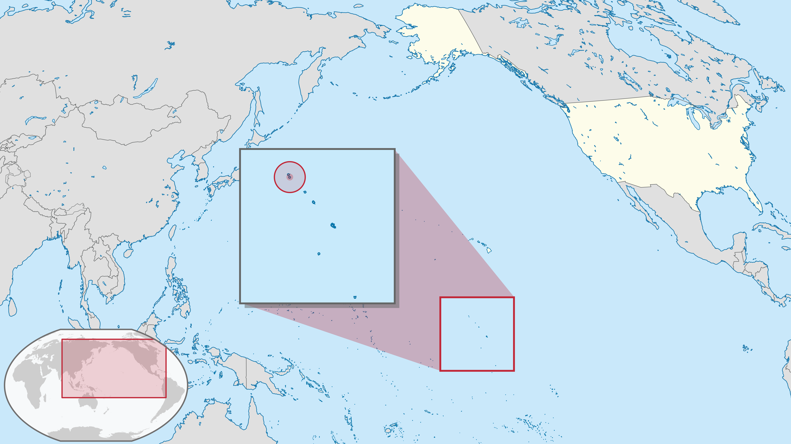

Compiled on `r date()`.

```{r setup, echo=FALSE, warning=FALSE, error=FALSE, message=FALSE}

library(knitr)
library(xtable)
library(pander)
library(dplyr)
library(tidyr)
library(ggplot2)
library(here)

options(knitr.kable.NA = '')

```

# Introduction to the Ocean Health Index + (OHI+) Palmyra assessment
- goal of project, joint project (logos)

The Ocean Health Index (OHI) is a scientific framework used to measure how healthy oceans are. Understanding the state of our oceans is a first step towards ensuring they can continue providing humans benefits now and in the future. 

OHI global assessments have been completed for 220 coastal nations and territories every year since 2012, and OHI assessments have also been completed at smaller scales. Code, training, and support is also provided for independent groups interested in leading their own OHI assessments. These are called independent OHI assessments, or “OHI+ assessments”. 

This report is a summary of the methods and results for the Palmyra OHI+ assessment, completed in 2020 in partnership with the Palmyra 4site team. The Palmyra OHI+ assessment uses the best-available data to measure progress toward target conditions for benefits provided by the atoll’s marine ecosystems, resulting in benefit-specific and overall health scores on a scale of 0 to 100. 

[insert OHI logo] [insert 4site logo]

- map showing location of islands



source: https://commons.wikimedia.org/wiki/File:Palmyra_Atoll_in_United_States.svg

- description of location

Palmyra Atoll is located in the Northern Line Islands in the west-central Pacific Ocean, 960 miles (1,545 km) southwest of Honolulu, Hawaii. Palmyra consists of around 50 islands in the shape of a horse shoe surrounding two lagoons. The atoll has a combined area of 4 square miles (10 square km) and has an average elevation of 6 feet (2 meters) above sea level, although vegetation rises to a height of 75-90 feet (23-27 meters). A platform of coral and hard sand surrounds the islands and lagoons. The lagoons are separated by arms of the platform reef, and reach depths of 120-160 feet (37-49 meters) (https://www.britannica.com/place/Palmyra-Atoll, https://www.doi.gov/oia/islands/palmyraatoll).

- bit of history

Palmyra Atoll was sighted in 1798 by an American ship, which did not land; but in 1802, the American ship Palmyra made landfall. The atoll was annexed by the Kingdom of Hawaii in 1862 and by Britain in 1889. In 1898 the United States annexed Palmyra as part of the Hawaiian Islands territory (https://www.britannica.com/place/Palmyra-Atoll). 

In the 1940s, the U.S. Navy stationed 6,000 sailors in the atoll. They dredged a seaplane runway which merged the atoll’s two western lagoons into one, and a causeway was built on the remaining reef. The sailors also joined three of the islands into one and built a land plane runway about one mile long, which the U.S. Air Force used until 1961 (https://www.doi.gov/oia/islands/palmyraatoll).

The Nature Conservancy (TNC) purchased Palmyra Atoll in December 2000 from the Fullard-Leo family to protect its unique ecosystem and establish a center for scientific investigation (https://www.nature.org/en-us/about-us/where-we-work/united-states/hawaii/stories-in-hawaii/palmyra-175-years-of-science/). It was declared a U.S. National Wildlife Refuge in January 2001, and includes submerged lands and associated waters out to 12 nautical miles from the atoll (https://www.fws.gov/refuge/Palmyra_Atoll/about.html). Palmyra was designated part of the Pacific Remote Islands Marine National Monument on January 6, 2009, which includes Palmyra Atoll National Wildlife Refuge within its boundaries, and protects it further out to 50 nautical miles (https://www.nature.org/en-us/get-involved/how-to-help/places-we-protect/palmyra-atoll/).


- bit of natural history

Palmyra’s native vegetation supports one of the largest remaining undisturbed stands of Pisonia beach forest in the Pacific, including native varieties of ferns and shrubs. The atoll’s rich intertidal sand and mudflats provide attractive resting and feeding grounds for migratory seabirds and shorebirds. Sooty terns, red- and white-tailed tropicbirds, several species of boobies, great frigate birds, and white terns are some of the common bird species that nest on Palmyra. The second largest red-footed booby colony in the world is found on the atoll, and more than 200 bristle-thighed curlews, whose worldwide population estimate is only 6,000 individuals, spend their winters on Palmyra. Palmyra’s waters are home to stony corals, giant clams, and over 400 species of fish, and are frequented by Pacific bottle-nosed dolphins, spinner dolphins, and melon headed whales. Threatened green and endangered hawksbill turtles are also found within the lagoon and waters surrounding the atoll. Large populations of the world’s largest land invertebrate, the coconut crab, inhabit Palmyra’s forests along with other crabs (https://www.fws.gov/refuge/Palmyra_Atoll/wildlife_and_habitat/index.html).

Rainforest once dominated the atoll, but copra farming, black rats, and deforestation by the U.S. military during World War II reduced Palmyra’s rainforest to a few patches. Thick groves of introduced coconut palms took its place, which are ill-suited for seabirds. There was a resurgence of native bird and plant life after rats were eradicated from Palmyra in 2011, and a major native rainforest restoration project is now underway. The aim of this project is to flip forest dominance and restore ecological balance to the atoll, which will maximize the seabird-driven nutrient cycle and increase terrestrial and marine ecosystem resilience to climate change impacts (https://www.nature.org/en-us/get-involved/how-to-help/places-we-protect/palmyra-atoll/). 


# Introduction to the global Ocean Health Index (OHI) assessment
- (Feel free to copy and paste from website, etc. Also, this section can be the same in both reports).

The global Ocean Health Index assesses ocean health for 220 coastal countries and territories and has been conducted every year starting in 2012. The Index describes how well we are sustainably managing 10 goals for ocean ecosystems which represent the full suite of benefits that people want and need from the ocean. These goals include: artisanal fishing opportunity, biodiversity, carbon storage, clean waters, coastal livelihoods and economies, coastal protection, food provision, natural products, sense of place, and tourism and recreation. Each goal is given a score ranging from 0 to 100, and the full suite of goal scores are then averaged to obtain an overall index score for each region.

For more information about the philosophy of the Ocean Health Index and model development see Halpern et al. (2012, 2015) and http://ohi-science.org/ohi-global/, which includes information about downloading global ocean health data.


# Maybe a quick summary of the overall results and conclusions.
- paragraph of overall, notable/interesting results
- flower plot
- table: quickly describes goal, score, (data?, reference point? trend?)

# Goal: Methods/Results
- Describe what the goal is measuring in the context of the OHI+ region and why this is relevant. I would also include the goals we are not including. I think the following should provide more on narrative descriptions of goals/models (vs. mathematical models and such...these are good to include, but I wouldn't use these in place of the narrative information).

## Status
- Data
- Reference point
how calculated (narrative of calculation plus, mathematical model)

## Trend
- Data
- how calculated

## Results

## Weaknesses

# Future
- Table describing datasets that would be ideal to collect for future iterations of the OHI assessment.
