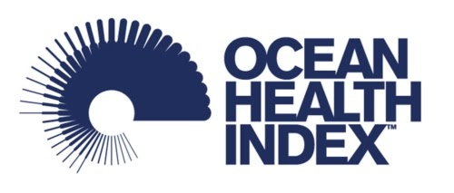
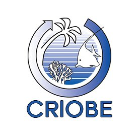

Compiled on `r date()`.

```{r setup, echo=FALSE, warning=FALSE, error=FALSE, message=FALSE}

library(knitr)
library(xtable)
library(dplyr)
library(tidyr)
library(ggplot2)
library(here)

options(knitr.kable.NA = '')

# Data and functions to list data layers in each goal 
# layers <- read.csv(here("metadata_documentation/layers_eez_base.csv"))
# targets <- read.csv(here("metadata_documentation/layers_eez_targets.csv"))
# 
# # Data layers function
# data_layers <- function(dimension, goal) { # goal = "ICO"; dimension=c("status", "trend")
#   st <- targets[targets$goal == goal, ]
#   st <- st[st$dimension %in% dimension, ]
# st <- st %>%
#   select(layer) %>%
#   unique()
# st_layers <- filter(layers, layer %in% st$layer) %>%
#   mutate(web_name = gsub(" ", "_", name)) %>%
#   mutate(web_name = tolower(web_name)) %>%
#   mutate(web_name = gsub("/", "", web_name)) %>%
#   mutate(info = sprintf("[%s](%s#%s) (%s): %s", name, layers_web, web_name, layer, description))
# cat(paste(st_layers$info, collapse="\n\n"))
# }
```

***

# Ocean Health Index (OHI) Global Assessment

The Ocean Health Index (OHI) is a scientific framework used to measure how healthy oceans are. Understanding the state of our oceans is a first step towards ensuring they can continue providing humans benefits now and in the future. The Index describes how well we are sustainably managing 10 goals for ocean ecosystems which represent the full suite of benefits that people want and need from the ocean. These goals include: Artisanal Fishing Opportunity, Biodiversity, Carbon Storage, Clean Waters, coastal Livelihoods and Economies, Coastal Protection, Food Provision, Natural Products, Sense of Place, and Tourism and Recreation. Each goal is given a score ranging from 0 to 100, and the full suite of goal scores are then averaged to obtain an overall index score for each region. The global Ocean Health Index (OHI) assesses ocean health for 220 coastal countries and territories and has been conducted every year starting in 2012. For more information about the philosophy of the Ocean Health Index and model development see http://ohi-science.org/ohi-global/. 

OHI assessments have also been completed at smaller scales. Code, training, and support is also provided for independent groups interested in leading their own OHI assessments. These are called independent OHI assessments, or “OHI+ assessments”.

***

# OHI+ Palmyra Assessment

## Project Goal

This report is a summary of the methods and results for the Palmyra OHI+ assessment, completed in 2020 in partnership with the Palmyra 4site team. The Palmyra OHI+ assessment uses the best-available data to measure progress toward target conditions for benefits provided by the atoll’s marine ecosystems, resulting in benefit-specific and overall health scores on a scale of 0 to 100. 

<div class = "row">
<div class = "col-md-2">
<br><br>
</div>

<div class = "col-md-2">
<br><br>
</div>

<div class = "col-md-4">
<br><br>
</div>

<div class = "col-md-2">
<br><br>
</div>

<div class = "col-md-2">
<br><br>
</div>
</div>


## Location

Palmyra Atoll is located in the Northern Line Islands in the west-central Pacific Ocean, 960 miles (1,545 km) southwest of Honolulu, Hawaii. Palmyra consists of around 50 islands in the shape of a horse shoe surrounding two lagoons. The atoll has a combined area of 4 square miles (10 square km) and has an average elevation of 6 feet (2 meters) above sea level, although vegetation rises to a height of 75-90 feet (23-27 meters). A platform of coral and hard sand surrounds the islands and lagoons. The lagoons are separated by arms of the platform reef, and reach depths of 120-160 feet (37-49 meters) (https://www.britannica.com/place/Palmyra-Atoll, https://www.doi.gov/oia/islands/palmyraatoll).

<center>
.](images/Palmyra_Atoll_map.png){width=56%} .](images/Aerial-Palmyra-Atoll.jpg){width=43%}
</center>

## History

Palmyra Atoll was sighted in 1798 by an American ship, which did not land; but in 1802, the American ship Palmyra made landfall. The atoll was annexed by the Kingdom of Hawaii in 1862 and by Britain in 1889. In 1898 the United States annexed Palmyra as part of the Hawaiian Islands territory (https://www.britannica.com/place/Palmyra-Atoll). 

In the 1940s, the U.S. Navy stationed 6,000 sailors in the atoll. They dredged a seaplane runway which merged the atoll’s two western lagoons into one, and a causeway was built on the remaining reef. The sailors also joined three of the islands into one and built a land plane runway about one mile long, which the U.S. Air Force used until 1961 (https://www.doi.gov/oia/islands/palmyraatoll).

The Nature Conservancy (TNC) purchased Palmyra Atoll in December 2000 from the Fullard-Leo family to protect its unique ecosystem and establish a center for scientific investigation (https://www.nature.org/en-us/about-us/where-we-work/united-states/hawaii/stories-in-hawaii/palmyra-175-years-of-science/). It was declared a U.S. National Wildlife Refuge in January 2001, and includes submerged lands and associated waters out to 12 nautical miles from the atoll (https://www.fws.gov/refuge/Palmyra_Atoll/about.html). Palmyra was designated part of the Pacific Remote Islands Marine National Monument on January 6, 2009, which includes Palmyra Atoll National Wildlife Refuge within its boundaries, and protects it further out to 50 nautical miles (https://www.nature.org/en-us/get-involved/how-to-help/places-we-protect/palmyra-atoll/).


## Natural History

Palmyra’s native vegetation supports one of the largest remaining undisturbed stands of Pisonia beach forest in the Pacific, including native varieties of ferns and shrubs. The atoll’s rich intertidal sand and mudflats provide attractive resting and feeding grounds for migratory seabirds and shorebirds. Sooty terns, red- and white-tailed tropicbirds, several species of boobies, great frigate birds, and white terns are some of the common bird species that nest on Palmyra. The second largest red-footed booby colony in the world is found on the atoll, and more than 200 bristle-thighed curlews, whose worldwide population estimate is only 6,000 individuals, spend their winters on Palmyra. Palmyra’s waters are home to stony corals, giant clams, and over 400 species of fish, and are frequented by Pacific bottle-nosed dolphins, spinner dolphins, and melon headed whales. Threatened green and endangered hawksbill turtles are also found within the lagoon and waters surrounding the atoll. Large populations of the world’s largest land invertebrate, the coconut crab, inhabit Palmyra’s forests along with other crabs (https://www.fws.gov/refuge/Palmyra_Atoll/wildlife_and_habitat/index.html).

Rainforest once dominated the atoll, but copra farming, black rats, and deforestation by the U.S. military during World War II reduced Palmyra’s rainforest to a few patches. Thick groves of introduced coconut palms took its place, which are ill-suited for seabirds. There was a resurgence of native bird and plant life after rats were eradicated from Palmyra in 2011, and a major native rainforest restoration project is now underway. The aim of this project is to flip forest dominance and restore ecological balance to the atoll, which will maximize the seabird-driven nutrient cycle and increase terrestrial and marine ecosystem resilience to climate change impacts (https://www.nature.org/en-us/get-involved/how-to-help/places-we-protect/palmyra-atoll/). 

***

# Maybe a quick summary of the overall results and conclusions.
- paragraph of overall, notable/interesting results
- flower plot
- table: quickly describes goal, score, (data?, reference point? trend?)

***

# Goals: Methods/Result

## Goals Included in Palmyra OHI+ Assessment:

The following goals were included in the Palmyra OHI+ assessment.

### Biodiversity (BD)

People value biodiversity in particular for its existence value. This goal assesses the conservation status of species based on the best available data through two sub-goals: Species (SPP) and Habitats (HAB). Species were assessed because they are what one typically thinks of in relation to biodiversity. Because only a small proportion of marine species worldwide have been mapped and assessed, we also assessed habitats as part of this goal, and considered them a proxy for condition of the broad suite of species that depend on them. We calculate each of these sub-goals separately and weight them equally when calculating the overall goal score.    

#### Habitats (HAB)

The Habitats sub-goal measures the average condition of habitats present on the island that provide critical habitat for a broad range of species. This sub-goal is considered a proxy for the condition of the broad suite of species on Palmyra. The atoll currently supports one of the best remaining coastal strand forests in the world (https://www.islandconservation.org/palmyra-atoll/). Given the importance of this ecosystem, both terrestrial and marine habitats are included in this assessment.   

**Current Status**  

The Habitats sub-goal includes coral reef habitats and rainforest habitats. A score is found for each habitat and then the average is taken to give an overall status score.
<br>   
*Coral Reefs*   

Four zones were used to calculate the coral reef status: back reef, reef crest, fore reef, and lagoon. 

Original raw data included 10 different zones, as shown in the map in Figure 4.1A. The following zones were grouped together to form the four reef zones of interest, as shown on the map in Figure 4.1B:    

 - Back Reef: Not grouped with any other zone   
 - Reef Crest: Reef Crest and Fore Reef  
 - Fore Reef: Bank/Shelf and Bank/Shelf Escarpment      
 - Lagoon: Lagoon and Channel  

<center>
{width=70%} {width=70%}  
</center>
***Figure 4.1 Coral zones.** Map A (top) displays coral zones as shown in the raw data and map B (bottom) shows the coral zones as they have been reclassified for this assessment.* <br>     
The fore reef is reassigned to part of the reef crest to better reflect the position of those data points on the reef. The Bank/Shelf and Bank/Shelf Escarpment are then grouped together and renamed as the fore reef with an additional designation to differentiate the western fore reef and the eastern fore reef. Based on a map of Palmyra, the longitude line 162.075 will be used to divide the fore reef into western and eastern. These groupings follow the zones delineated by NOAA in the Coral Reef Ecosystems Monitoring Report for the Pacific Remote Islands Marine National Monument, available [here](https://repository.library.noaa.gov/view/noaa/23421).  
 
Coral condition is based on the percent of live coral cover in each of the zones. The reference point, or target live coral cover range, for each zone is:   

 - Back Reef:  10-50% live coral cover  
 - Reef Crest: 10-50% live coral cover      
 - Fore Reef:  50-90% live coral cover     
 - Lagoon:     10-50% live coral cover       

The western and eastern fore reef both have the same reference point.   

Coral reef status is first calculated for each zone. The status is calculated as the area of the reef zone falling within or above the reference point category divided by the total area of the reef zone (Equation 4.1).     

$$
status_{zone}~=~\frac { A_{ref} } { A_{total} },  ~~(Eq~4.1) 
$$  

Where $A_{ref}$ is the area of the reef zone falling within or above the reference point category and $A_{total}$ is the total area of the reef zone. For the status calculation we adjust the area of the lagoon to include only the area of the lagoon where coral can reasonably grow. Other zones are not area adjusted due to incomplete knowledge and data. In the future adjusting the area of all zones to include only the area where coral can be expected to grow would strengthen this analysis.          

The overall status score is calculated as the area weighted mean of the status score for each zone. Here we use the total area of the lagoon.
<br>   
*Rainforests*   

The rainforest condition is based on the land area of the rainforest. Invasive coconut palms (*Cocos nucifera*) are limiting the land area that can be occupied by native rainforests. Palmyra has planned coconut palm removal activities, which they hope will increase the land area of native forests.   

The raw data included four vegetation categories: native forests, *Scaevola*, non-vegetated areas, and *Cocos nucifera* (coconut palm). The native forest and *Scaevola* categories were grouped together to find the total forest land area. Non-vegetated areas were excluded from the analysis.   

The rainforest habitat status is calculated based on the area of rainforest currently present compared to the area of rainforest that would exist once 95% of the historic area of coconut palm has been removed (Equation 4.2). The reference point is the rainforest and coconut palm area in 2001.    

$$
status~=~ \frac { A_{current} } { A_{potential} }, ~~(Eq ~4.2) 
$$  

The current rainforest area ($A_{current}$) km^2^ is based on the Burnett, M.W. *et al.* 2019 study where forest is defined as the total area of the *Scaevola* and native forest categories.    

The potential rainforest area ($A_{potential}$) km^2^ is based on a 2001 satellite image showing approximately 43% of the islands are dominated by coconut plantations and 48.2% of the islands are dominated by other vegetation communities as discussed in the [USGS Terrestrial Management Plan](https://pubs.usgs.gov/of/2011/1007/pdf/ofr20111007.pdf). The remaining 8.8% is assumed to be non-vegetated and is excluded from this analysis. The total land area ($A_{total}$) used in these calculations (2.46 km^2^) was derived from a study completed in 2000 (referenced in Burnett *et al* 2019), which is the closest land estimate we could obtain to the 2001 satellite image. The potential rainforest area is calculated as the land area added once 95% of the historic palm plantations are removed plus the original 48.2% of land area that was dominated by rainforests (Equations 4.3 - 4.5).     

$$
A_{potential}~=~A_{added}~+~A_{original} , ~~(Eq ~4.3)
$$

And where   

$$
A_{added}~=~0.95~*~(0.43~*~A_{total}), ~~(Eq~ 4.4)
$$   
$$
A_{original}~=~0.482~*~A_{total}, ~~(Eq~4.5)
$$   

**Trend** 
<br>   
*Coral Reefs* 

The benthic habitat mapping project used to calculate the current status was the first study of its kind on Palmyra Atoll. As no similar studies have been done previously which estimate historic live coral cover across the different reef zones, an estimate of coral trend was derived from the OHI Global Assessment. The OHI global trend data are calculated as a linear trend in coral condition, on a per country basis across all available data from 1975-2006. More information on the coral trend method can be found in the [OHI Global Methods](https://raw.githack.com/OHI-Science/ohi-global/published/documents/methods/Supplement.html#62_biodiversity) documentation, Section 6.2.1. No coral trend was available for Palmyra in the OHI Global Assessment, so instead it was estimated by averaging the trend in coral reef habitats for all countries in Micronesia.
<br>   
*Rainforests* 

The trend in rainforest condition is calculated as the rate of change in forest area per year from 2005-2019. The trend is the five year average change in rainforest area. The linear trend is calculated based on rainforest area in 2005, 2010, 2016, and 2019. 
<br>   
**Data**   

_Status and trend_

```{r hab-data-st, results="asis", echo=FALSE}
#data_layers(goal="HAB", dimension=c("status", "trend"))
```

_Pressure_

```{r hab-data-p, results="asis", echo=FALSE}
#data_layers(goal="HAB", dimension=c("pressure"))
```

_Resilience_

```{r hab-data-r, results="asis", echo=FALSE}
#data_layers(goal="HAB", dimension=c("resilience"))
```
<br> 
**Data Citations**
<br>   
*Coral Reefs* 

Data to calculate the current status of coral reefs were gathered from National Centers for Coastal Ocean Science (NCCOS) benthic habitat mapping project for Palmyra Atoll, completed in 2011. The data are available for download [here](https://products.coastalscience.noaa.gov/collections/benthic/e58palmyra/#horizontalTab3).    

Date Downloaded: June 30, 2020

Citation: U.S. Department of Commerce, National Oceanic and Atmospheric Administration, National Center for Coastal Ocean Sciences. (2011). Palmyra Habitat Maps [Data file]. Retrieved from https://products.coastalscience.noaa.gov/collections/benthic/e58palmyra/
<br>   
*Rainforests* 

Data to calculate the current status of rainforests were gathered from a recent publication on coconut palms in Palmyra completed in 2019. Data were downloaded from Table A1, available [here](https://www.tandfonline.com/doi/figure/10.1080/01431161.2019.1594440?scroll=top&needAccess=true). 

Date Downloaded: July 8, 2020

Citation: Burnett, M.W. *et al.* (2019). "Quantifying coconut palm extent on Pacific islands using spectral textural analysis of very high resolution imagery". *International Journal of Remote Sensing* 40(19): 7329-7355   
  [Available here](https://www.tandfonline.com/doi/epub/10.1080/01431161.2019.1594440?needAccess=true). 
  
2001 Reference Point: The 2001 reference point comes from a satellite image of the island that is discussed in the 2011 Terrestrial Forest Management Plan.  

Citation: Hathaway, S.A., McEachern K., & Fisher, R.N. (2011). "Terrestrial Forest Management Plan for Palmyra Atoll". U.S. Geological Survey Open-File Report 2011-1007.  
  [Available here](https://permanent.fdlp.gov/gpo119875/ofr20111007.pdf)  
  
There have been no studies using the same methodology to track the area of forests and coconut palm on the island over time. Therefore, data to calculate the trend in rainforest condition are estimated from three additional studies that included some estimate of percent cover of coconut palms and total land area.    

2005: The 2005 data was obtained from Alex Wegmann at The Nature Conservancy on July 31, 2020. Shapefiles were compiled as part of Alex Wegmann's PhD dissertation.  

2010: The 2010 data is estimated from a study on invasive rats that quantified the percent of land area on each islet occupied by *Cocos nucifera* (Table 1).    

Citation: Lafferty, K.D. et al. (2010). "Stomach nematodes (*Mastophorus muris*) in rats (*Rattus rattus*) are associated with coconut (*Cocos nucifera*) habitat at Palmyra Atoll. *Journal of Parasitology* 96(1): 16-20.   
  [Available here](https://bioone.org/journals/Journal-of-Parasitology/volume-96/issue-1/GE-2180.1/Stomach-Nematodes-Mastophorus-muris-in-Rats-Rattus-rattus-Are-Associated/10.1645/GE-2180.1.full)   
  
2016: The 2016 data is estimated using a U.S. Geological Survey vegetation community mapping project for Palmyra Atoll. Vegetation maps were completed in October 2016 and published in June 2019. Data is available for download [here](https://www.sciencebase.gov/catalog/item/5c66fc5be4b0fe48cb3aca49).   

Date Downloaded: July 2, 2020  

Citation: Struckhoff, M.A., 2019, Woody species crown and vegetation community data, Palmyra Atoll, 2016: U.S. Geological Survey data release, https://doi.org/10.5066/P9GMPVIO.  
<br>   

#### Species (SPP)

The Species sub-goal aims to assess the average condition of species in Palmyra. Both marine and terrestrial species are included in this sub-goal.    
 
**Current Status** 

A list of species occurring in Palmyra was created using IUCN range maps and supplemented with fish and bird lists obtained from The Nature Conservancy for a total of 587 species. Species condition was pulled from the IUCN Red List (IUCN 2020).   

The reference point for the Species sub-goal is all species have an IUCN status of "Least Concern".   

Threat weights, were assigned based on the IUCN threat categories status of each species, following the weighting schemes developed by Butchart *et al* (2007) (Table 4.1). For the purposes of this analysis, we included only data for extant species for which sufficient data were available to conduct an assessment. We did not include the Data Deficient classification as assessed species following previously published guidelines for a mid-point approach (Schipper *et al.* 2008; Hoffmann *et al.* 2010).
<br>   
***Table 4.1. Weights for assessment of species status based on IUCN risk categories.***

| Risk Category   | IUCN code | Weight|
|-----------------|-----------|-------|
| Least Concern   |     LC    |  0.0  |  
| Near Threatened |     NT    |  0.2  |
| Vulnerable      |     VU    |  0.4  |
| Endangered      |     EN    |  0.6  |
| Critically Endangered | CR  |  0.8  |
| Extinct         |     EX    |  1.0  |   
  
The species fall within 10 different taxonomic classes and to avoid over weighting, the status is first calculated for each class as the average of the extinction risk scores. An overall extinction risk status is then found by averaging the extinction risk score of all 10 classes. Finally, the score is rescaled so a risk factor of 0.75 is equal to zero (Equation 4.6).   

$$
status~=~ \frac { (0.75~-~risk_{avg}) } {0.75}, ~~~~(Eq ~4.6)
$$   

Where $risk_avg$ is the average extinction risk score, found by averaging the mean extinction risk score of all 10 classes. 

This assigns a score of 0 when 75% species are extinct, a level comparable to the five documented mass extinctions (Barnosky *et al.* 2011) and would constitute a catastrophic loss of biodiversity.
<br>    
**Trend** 

The species trend is calculated using data the IUCN provides for current and past assessments of species. Discrete species assessments between 1965-2020 are used to estimate annual change in IUCN risk status for each species. Species trend is evaluated for species with more than two past assessments. Trend for species with less than two past assessments is estimated using the population trend noted in species history information. We then summarize these species trend values for each region using the same general approach used to calculate status.
<br>   
**Data**

_Status and trend_

```{r spp-data-st, results="asis", echo=FALSE}
#data_layers(goal="SPP", dimension=c("status", "trend"))
```

_Pressure_

```{r spp-data-p, results="asis", echo=FALSE}
#data_layers(goal="SPP", dimension=c("pressure"))
```

_Resilience_

```{r spp-data-r, results="asis", echo=FALSE}
#data_layers(goal="SPP", dimension=c("resilience"))
```
<br> 
**Data Citations**   

The original species list, species condition and historic assessments are based on the IUCN Red List.    

Date Accessed: June 9, 2020   

Citation: IUCN 2020. IUCN Red List of Threatened Species. Version 2020-1 <www.iucnredlist.org>.  

Additional species lists were provided by Alex Wegmann at The Nature Conservancy on July 8, 2020
<br>   

### Clean Waters (CW)

People value marine waters that are free of pollution and debris for aesthetic and health reasons. Although Palmyra has a limited population, people are sensitive to pollution and debris in areas they access for recreation or other purposes as well as for simply knowing that clean waters exist. Due to limited data availability, this goal includes two sources of pollution - marine debris and soil contamination. The main source of pollution on the island is marine debris from the fishing aggregation devices (FADs) and the military history of the island has left a legacy of soil contamination. The overall Clean Waters score is the geometric mean of these two layer scores. This goal scores highest when the contamination level is zero.
<br>   
**Current Status**   
The current status for the Clean Waters goal is the geometric mean of the status of the two layers: marine debris and soil contamination.
<br>   
*Marine Debris*  

Marine debris current status is calculated based on the number of annual grounded FADs. The reference point for marine debris is to reduce FAD groundings by 50% of the highest annual recorded number of groundings between 2009-2019. The highest annual groundings occurred in 2016, with 12 groundings, so the reference point will be 6 annual FAD groundings. Any year where six or less FAD groundings were recorded will receive a perfect score.

The current status is scaled between 0-1 by subtracting the reference point from the number of groundings and then dividing by the reference point (Equation 4.7).     

$$
status~=~ \frac { (fad_{y}~-~fad_{ref}) } { fad_{ref} }, ~~~(Eq ~4.7)
$$   

Where $fad_{y}$ is the yearly number of recorded FAD groundings and $fad_{ref}$ is the reference point number of 6 annual FAD groundings.  

This gives high scores to years with greater levels of marine debris. This status is used as a pressure layer. The final status layer for the Clean Waters goal is the inverse of this status score, found using 1 - status.
<br>   
*Soil Contamination*   

The current status is based on the observed concentration of each element (mg/kg wet weight). A total of 155 sites were sampled in 2008 and an additional 41 sites were sampled in 2010. At each site concentrations were recorded for 13 elements: antimony (Sb), arsenic (As), chromium (Cr), cobalt (Co), copper (Cu), iron (Fe), lead (Pb), manganese (Mn), nickel (Ni), phosphorus (P), sulfur (S), titanium (Ti), and zinc (Zn). However, only 9 elements are included in the analysis. Iron is generally considered non-toxic and titanium, sulfur, and phosphorus were detected but do not have established Threshold Effects Levels (TELs) or ecological soil screening levels (Eco-SSLs); therefore, they will be excluded from the analysis.  

Two different reference levels will be used to scale the contamination scores from 0-1. A TEL will be used to first scale values from 0 - 0.5. Any observed concentration equal to the TEL will receive a score of 0.5. The TEL are the lower end of values below which harmful impacts are not likely to be observed. The upper end of the scores will be based on the Probable Effect Level (PEL); this represents a value above which harmful impacts are likely to be observed. Any observed concentration above the PEL will be assigned a score of 1.  

<u>TEL</u>   

TEL reference levels were assigned based on the TELs established by the U.S. Environmental Protection Agency for marine sediments and the lowest established Eco-SSLs for any taxonomic group. TEL and Eco-SSL values (mg/km dry weight) for the most frequently detected contaminants on Palmyra (Table 4.2) are replicated from Table 1 of Struckhoff *et al* 2018.
<br>   
***Table 4.2. Midpoint reference levels.** Threshold Effect Levels (TELs) and Ecological soil screening levels (Eco-SSLs) for the main contaminants found in soils around Palmyra. NA indicates a toxicity threshold has not been established. These values are used as the midpoint reference levels in the status calculation.*           

| Contaminant | Symbol | TEL   | Eco-SSL |
|-------------|--------|-------|---------|
| Antimony    | Sb     | NA    | 78      |
| Arsenic     | As     | 7.24  | 18      |
| Chromium    | Cr     | 52.3  | 26      |
| Colbalt     | Co     | NA    | 13      |
| Copper      | Cu     | 118.7 | 28      |
| Lead        | Pb     | 30.24 | 11      |
| Manganese   | Mn     | NA    | 220     |
| Nickel      | Ni     | 15.9  | 38      |
| Zinc        | Zn     | 124   | 46      |. 

TELs are used for marine sediments and the lowest Eco-SSL is used for soil samples. Where no TEL is established, the lowest Eco-SSL is used in its place. The table reports thresholds in mg/kg of dry weight, however most of the samples collected were made on moist samples. Struckoff *et al* 2018 notes:   

"Soil moisture values between 15 and 25% can reduce measured sample concentrations from 70 to 80% relative to lab-confirmed concentrations (U.S. Environmental Protection Agency, 2015). Given that most measurements were made on moist samples, XRF values reported above TELs or SSLs are conservative estimates of threshold exceedance."  

<u>PEL</u>   

For soil samples, the Canadian freshwater contamination PELs (mg/kg dry weight) are used (Table 4.3), as these are more conservative than the marine contamination levels. Consensus-based freshwater PELs were established in 2000. Concentrations were replicated from Table 3 in MacDonald *et al* 2000.
<br>   
***Table 4.3. Soil sample upper reference levels** Freshwater contamination Probable Effect Levels (PELs) for the main contaminants found in soils around Palmyra. These levels are used as the upper reference level for soil samples in the status calculation.*   

| Contaminant | Symbol | PEL   | 
|-------------|--------|-------|
| Arsenic     | As     | 17    |
| Chromium    | Cr     | 90    |
| Copper      | Cu     | 197   |
| Lead        | Pb     | 91.3  |
| Nickel      | Ni     | 36    |
| Zinc        | Zn     | 315   | 

Marine sediment PELs (mg/kg of dry weight) are obtained from NOAA guidelines established in 1999 (Table 4.4). These are called Effect Range Median (ERM) levels, which is the NOAA equivalent of PELs. Concentrations were obtained from Table 1 in the NOAA 1999 guidance.
<br>   
**Table 4.4. Marine sediment upper reference levels.** Marine sediment Probable Effect Levels (PELs) for the main contaminants found in soils around Palmyra. These levels are used as the upper reference level for marine sediment samples in the status calculation.*   

| Contaminant | Symbol | PEL   | 
|-------------|--------|-------|
| Arsenic     | As     | 70    |
| Chromium    | Cr     | 370   |
| Copper      | Cu     | 270   |
| Lead        | Pb     | 218   |
| Nickel      | Ni     | 51.6  |
| Zinc        | Zn     | 410   |

No PELs are available for Antimony, Colbalt, and Manganese. For these we will approximate an upper limit that is one order of magnitude higher than the established TEL or Eco-SSL.  

Contaminants are scaled 0-1 using a midpoint level, (TEL or ECO-SSl) and an upper level (PELs). A status is then calculated for each site using the geometric mean of the 9 contaminants (Equation 4.8).  
$$
status_{site} = \sqrt [ 9 ]{ As~*~Cr~*~Co~*~Cu~*~Pb~*~Mn~*~Ni~*~Sb~*~Zn ~},  ~~(Eq ~4.8)
$$ 
Finally, an overall status is found using an area weighted mean of the site status (Equation 4.9):      

$$ 
status~=~\frac { \displaystyle\sum _{ i=1 }^{ N }{ { A }_{ i }{ s }_{ i } } } { \displaystyle\sum _{ i=1 }^{ N } { A }_{ i } }, ~~(Eq ~4.9)
$$
where $A_i$ is the area and $s_i$ is the status of contamination for each site $i$.  

This gives high scores to years with greater levels of contamination. This status is used as a pressure layer. The final status layer for the Clean Waters goal is the inverse of this status score, found using 1 - status.
<br>   
**Trend**
<br>   
*Marine Debris*   

The trend in marine debris is calculated as the rate of change in the number of grounded fishing aggregation devices from 2014 - 2020.
<br>  
*Soil Contamination*   

This the first study on soil contamination done for Palmyra Atoll, although a second study is currently underway. Contamination sources are remnants of military action on the island during World War II. Based on the minimal change in current status from 2008 to 2010, we are assuming that there has been no change in contamination levels. Therefore, a trend of 0 is being used until additional information is obtained.
<br>   
**Data**

_Status and trend_

```{r cw-data-st, results="asis", echo=FALSE}
#data_layers(goal="CW", dimension=c("status", "trend"))
```

_Pressure_

```{r cw-data-p, results="asis", echo=FALSE}
#data_layers(goal="CW", dimension=c("pressure"))
```

_Resilience_

```{r cw-data-r, results="asis", echo=FALSE}
#data_layers(goal="CW", dimension=c("resilience"))
```
<br> 
**Data Citations**   

*Marine Debris*   

Data to calculate the marine debris layer come from a table of FADs found ashore on Palmyra Atoll. Data were obtained from Alex Wegmann at The Nature Conservancy on July 8, 2020.
<br>   
*Soil Contamination*   

Data for this layer come from an elemental soil contamination study completed by the U.S. Geological Survey at sites on Palmyra Atoll in 2008 and 2010. Data were published in 2017 and can be accessed [here](https://www.sciencebase.gov/catalog/item/5925b2cae4b0b7ff9fb3ca3d).  

Date Downloaded: July 28, 2020   

Citation: Struckhoff, M.A., Papoulias, D.M., Orazio, C.E., Annis, M.L., Shaver, D.K. and Tillitt, D.E., 2017, Geospatial data of elemental contamination at Palmyra Atoll, 2008 and 2010: U.S. Geological Survey data release, https://doi.org/10.5066/F74F1P00  

The reference levels were obtained from the following sources:  

<u>TELs and Eco-SSLs</u>   

Citation: Struckhoff, M.A., Orazio, C.E., Tillitt, D.E., Shaver, D.K., and Papoulias, D.M. (2018). Mapping elemental contamination on Palmyra Atoll National Wildlife Refuge. *Marine Pollution Bulletin*, 128: 97-105. https://doi.org/10.1016/j.marpolbul.2017.12.065.  

<u>PELs and ERMs</u>   

Citation: MacDonald, D.D., Ingersol, C.G., and Berger, T.A. (2000). Development and Evaluation of Consensus-Based Sediment Quality Guidelines for Freshwater Contamination. *Archives of Environmental Contamination and Toxicology.* 39:20-31. DOI: 10.1007/s002440010075   
    Available [here](https://link.springer.com/content/pdf/10.1007/s002440010075.pdf)   

Citation: National Oceanic and Atmospheric Administration. (1999). Sediment Quality Guidelines developed for the National Status and Trend Program. 

### Habitat Services (HS)

The Habitat Services (HS) goal measures additional services provided by habitats on Palmyra in addition to supporting biodiversity. The Habitat Services goal is made up of two equally weighted sub-goals, Carbon Storage (CS) and Coastal Protection (CP).
<br>   

####  Carbon Storage (CS) 

The Carbon Storage sub-goal measures the health of carbon storing habitats. In Palmyra, the only Carbon Storage habitat is the terrestrial rainforest. We use data on habitat extent in the same manner as Biodiversity: Habitats sub-goal. Since only one habitat is included, there are no Carbon Storage weights used in the calculation.  

**Current Status**   

The Carbon Storage subgoal is based on the percent cover of native tree species on the island. 

The following tree species are included in the mapping project raw data and we have designated if they are native or nonnative (Table 4.5). Category designations were assigned based on species lists found in Tables 1 and 2 of the U.S. Geological Survey 2011 Terrestrial Forest Management Plan for Palmyra Atoll, found [here](https://permanent.fdlp.gov/gpo119875/ofr20111007.pdf).
<br>   
***Table 4.5. Tree species classifications.***   

| Species                      | Classification | 
|------------------------------|----------------| 
| *Araucaria*                  | Nonnative      |  
| *Artocarpus altilis*         | Nonnative      |
| *Barringtonia asiatica*      | Native         |
| *Calophyllum inophyllum*     | Nonnative      |  
| *Casuarina equisetifolia*    | Nonnative      |    
| *Coccoloba uvifera*          | Nonnative      |
| *Cocos nucifera*             | Nonnative      | 
| *Cordia subcordata*          | Native         |  
| *Guettarda speciosa*         | Native         | 
| *Heliotropium foertherianum* | Native         | 
| *Hernandia nymphaeifolia*    | Native         |    
| *Hibiscus tiliaceus*         | Nonnative      | 
| *Ipomoea*                    | Native         |     
| *Nephrolepis*                | Nonnative      |
| *Pandanus tectorius*         | Native         |  
| *Phymatosorus scolopendria*  | Native         |
| *Pisonia grandis*            | Native         |
| *Premna serratifolia*        | Native         | 
| *Scaevola taccada*           | Native         |
| *Terminalia catappa*         | Nonnative      |   
 
Unknown tree species and standing water were excluded from the analysis, as were *Ipomoea* and *Nephrolepis* since they are not trees.      

The reference point for Carbon Storage is 95% of the forest area dominated by native tree species.  
 
Current status is calculated as the current percent of forest dominated by native trees in year (y) over the reference point percentage (Equation 4.10).    

$$
status~=~ \frac {percent~cover_{y} } {percent~cover_{ref} }~,  ~~~(Eq ~4.10)
$$
<br>   
**Trend**   

The Carbon Storage trend will use the same data as the rainforest condition trend calculated for the Biodiversity: Habitats sub-goal. 

There is a lack of historic data categorizing forests as native or nonnative to the level of detail used in the Carbon Storage status calculation. Therefore, the best estimate for trend is based on the trend in the condition and extent of rainforest habitats. If rainforests are healthy and growing in extent, there will be better opportunities for carbon storage. For details on the methodology for calculating rainforest trend refer to the Biodiversity: Habitats sub-goal.
<br>   
**Data**  

_Status and trend_

```{r cs-data-st, results="asis", echo=FALSE}
#data_layers(goal="CS", dimension=c("status", "trend"))
```

_Pressure_

```{r cs-data-p, results="asis", echo=FALSE}
#data_layers(goal="CS", dimension=c("pressure"))
```

_Resilience_

```{r cs-data-r, results="asis", echo=FALSE}
#data_layers(goal="CS", dimension=c("resilience"))
```
<br> 
**Data Citations**   

Data for the Carbon Storage status come from tree cover surveys completed as part of the U.S. Geological Survey vegetation community mapping project for Palmyra Atoll. Vegetation maps were completed in October 2016 and published in June 2019. The data is available for download [here](https://www.sciencebase.gov/catalog/item/5c66fc5be4b0fe48cb3aca49).    

Date Downloaded: July 7, 2020       

Citation: Struckhoff, M.A., 2019, Woody species crown and vegetation community data, Palmyra Atoll, 2016: U.S. Geological Survey data release, https://doi.org/10.5066/P9GMPVIO.  

The Carbon Storage trend uses the data from the rainforest trend calculated for the Biodiversity: Habitats subgoal. For details on the data used for calculating rainforest trend refer to the Biodiversity: Habitats sub-goal.  
<br>   

#### Coastal Protection (CP)

The Coastal Protection sub-goal measures the health of habitats that contribute to coastal protection from storm surge, flooding, and sea level rise. In Palmyra, the only Coastal Protection habitat are coral reefs. We use data on habitat extent in the same manner as the Biodiversity: Habitats sub-goal.   

**Current Status**   

The Coastal Protection current status is found using the condition and extent of coral reef habitat. Coral condition is the current condition of coral reef habitat relative to the reference point. This is the same as the coral status calculated in the Biodiversity: Habitats sub-goal. For more information about how the condition of coral reef status is calculated, refer to the methodology for the Biodiversity: Habitats sub-goal. The extent of coral reefs is calculated as the total reef area.   

The Coastal Protection status is calculated as the relative health of the habitats that provide coastal protection weighted by their area and protectiveness rank (Equation 4.11).     

$$
status~=~ \frac { (C~*~A~*~w) } { (A~*~w) }~, ~~~(Eq ~4.11) 
$$   

Where $C$ is the condition of coral habitats as defined above, $A$ is the area of coral reef habitat, and $w$ is the protectiveness rank for coral reefs. Coral reefs are the only habitat included in the Coastal Protection sub-goal for Palmyra, so the protectiveness rank and area cancels out, leaving the current status for Coastal Protection equivalent to the coral reef condition calculated in the Biodiversity: Habitats sub-goal.
<br>   
**Trend**   

The Coastal Protection trend will use the same data as the coral condition trend calculated for the Biodiversity: Habitats sub-goal. 

Coral condition is lacking historic data for all areas of the reef used to estimate current status (fore reef, reef crest, back reef, and lagoon). Therefore, the trend of coral condition will be estimated using the OHI global data. The OHI global trend data is calculated as a linear trend in coral condition, calculated on a per country basis across all available data from 1975-2006. More information on the coral trend method can be found in the [OHI Global Methods](https://raw.githack.com/OHI-Science/ohi-global/published/documents/methods/Supplement.html#62_biodiversity) documentation, Section 6.2.1. No coral trend was available for Palmyra in the OHI Global Assessment, so instead it was estimated by averaging the trend in coral reef habitats for all countries in Micronesia.
<br>   
**Data**   

_Status and trend_

```{r cp-data-st, results="asis", echo=FALSE}
#data_layers(goal="CP", dimension=c("status", "trend"))
```

_Pressure_

```{r cp-data-p, results="asis", echo=FALSE}
#data_layers(goal="CP", dimension=c("pressure"))
```

_Resilience_

```{r cp-data-r, results="asis", echo=FALSE}
#data_layers(goal="CP", dimension=c("resilience"))
```
<br>    

**Data Citations**   

Coral reef extent and condition data are the same data used in the coral habitat status layer. Coral reef data were gathered from National Centers for Coastal Ocean Science (NCCOS) benthic habitat mapping project for Palmyra Atoll, completed in 2011. The data is available for download [here](https://products.coastalscience.noaa.gov/collections/benthic/e58palmyra/#horizontalTab3).    

Date Downloaded: June 30, 2020

Citation: U.S. Department of Commerce, National Oceanic and Atmospheric Administration, National Center for Coastal Ocean Sciences. (2011). Palmyra Habitat Maps [Data file]. Retrieved from https://products.coastalscience.noaa.gov/collections/benthic/e58palmyra/   

### Research (RS)

This goal attempts to capture the aspects of the marine and terrestrial environment that support scientific research on Palmyra Atoll. Healthy ecosystems on the island support research and advance scientific understanding. The research goal is based on three equally weighted layers: employment, research funding, and scientific publications.
<br>   

**Current Status**   

Current status for the research goal is the average of the layer scores for: employment, research funding, and scientific publications.
<br>   
*Employment*  

The employment layer is calculated based on the number of full time equivalent (FTE) positions in conservation science supported by The Nature Conservancy. The reference point for employment is five FTE positions. Status scores are re-scaled to 0-1 by dividing the number of FTE positions by the reference point (Equation 4.12). Any value over one is given a score of 1.     

$$
status~=~ \frac { FTE_{y} } { FTE_{ref} }, ~~(Eq ~4.12)
$$  

Where $FTE_{y}$ is the number of full-time equivalent positions in year (y) and $FTE_{ref}$ is the FTE positions reference point.     
<br>   
*Research Funding*   

<br>   
*Scientific Publications*   

The publications layer is calculated based on the number of scientific studies published about resources on Palmyra each year. The reference point is 10 annual publications. Status scores are re-scaled to 0-1 by dividing the number of scientific publications by the reference point (Equation 4.13).  

$$
status~=~ \frac { pubs_{y} } { pubs_{ref} },  ~~(Eq ~4.13)
$$  

Where $pubs_{y}$ is the number of scientific publications in year (y) and $pubs_{ref}$ is the number of publications reference point.
<br>   
**Trend**   

*Employment*   

The trend in employment is calculated as the rate of change in the number of full-time equivalent positions from 2014-2020. 
<br>  
*Research Funding*   
<br>   
*Scientific Publications*   

The trend in scientific publications is calculated as the rate of change in the number of scientific papers published annually from 2014-2020.
<br>   
**Data**   

_Status and trend_

```{r rs-data-st, results="asis", echo=FALSE}
#data_layers(goal="RS", dimension=c("status", "trend"))
```

_Pressure_

```{r rs-data-p, results="asis", echo=FALSE}
#data_layers(goal="RS", dimension=c("pressure"))
```

_Resilience_

```{r rs-data-r, results="asis", echo=FALSE}
#data_layers(goal="RS", dimension=c("resilience"))
```
<br>   
**Data Citations**   

*Employment*   
Data for this layer were gathered through verbal communication with Alex Wegmann at The Nature Conservancy on July 8, 2020.   

*Scientific Publications*   
Data for this layer comes from a scientific library containing all scientific publications relating to natural resources on Palmyra Atoll. This scientific library was obtained from Alex Wegmann at The Nature Conservancy on June 17, 2020.  

### Resource Access Opportunity (RAO)

This goal is intended to measure access to recreational fishing opportunities on Palmyra Atoll. Access to recreational fishing is mandated within the National Wildlife Refuge by the U.S. Fish and Wildlife Service. 

**Current Status**   

Current status is based on the number of fish caught per year compared to the reference point. The reference point is up to 20 fish caught per year for sustenance fishing. The status score is scaled such that any catch three times or more than three times higher than the reference point is given a score of zero (Equation 4.14):       

$$
status~=~ \frac { (c_{y}~-~c_{ref,y}) } { s },  ~~(Eq ~4.14)
$$ 
where $c_{y}$ is the number of fish caught in year (y), $c_{ref,y}$ is the reference point catch in year (y), and $s$ is the scaling coefficient used to adjust any catch level at or higher than three times the reference point to a score of zero. Any scores higher than one are given a one and any scores lower than zero are given a zero. This method of scoring is based on The Nature Conservancy's management goals to keep fishing at or below the reference point level and reflective of the view that fishing at more than three times the reference point would cause unnecessary damage to the ecosystem.       
<br>   
**Trend** 

The trend for tourism and recreation is calculated as the rate of change in the number of annual private vessels visiting the island from 2014-2020.
<br>   
**Data**   

_Status and trend_

```{r rao-data-st, results="asis", echo=FALSE}
#data_layers(goal="RAO", dimension=c("status", "trend"))
```

_Pressure_

```{r rao-data-p, results="asis", echo=FALSE}
#data_layers(goal="RAO", dimension=c("pressure"))
```

_Resilience_

```{r roa-data-r, results="asis", echo=FALSE}
#data_layers(goal="RAO", dimension=c("resilience"))
```
<br>   
**Data Citations**   

Data to inform this layer were obtained via email from Alex Wegmann at The Nature Conservancy and Stephan Kropidlowski from U.S. Fish and Wildlife Service on August 17, 2020.  

### Sense of Place (SP)

This goal attempts to capture the aspects of the coastal and marine system that people value as part of their cultural identity. This definition includes people living near the ocean and those who live far from it but still derive a sense of identity or value from knowing particular places or species exist. While there are only a small handful of residents on Palmyra, the island's pristine ecosystems are valued by scientists, researchers, and conservationists among others. This goal is calculated using two equally weighted sub-goals: iconic species (ICO) and lasting special places (LSP).   

#### Iconic Species (ICO)

Iconic species are those that are relevant to local cultural identity through their relationship to one or more of the following: 1) traditional activities such as fishing, hunting or commerce; 2) local ethnic or religious practices; 3) existence value; and 4) locally-recognized aesthetic value (e.g., touristic attractions/common subjects for art such as whales). Ultimately, almost any species can be iconic to someone, and so the intent with this goal was to focus on those species widely seen as iconic from a cultural or existence value (rather than a livelihoods or extractive reason). 

A primary iconic species for Palmyra was gathered based on species listed on the U.S. Fish and Wildlife Service webpage for the Palmyra Atoll National Wildlife Refuge. This list was supplemented with species identified as globally iconic (World Wildlife Fund Flagship species and Priority species) or regionally iconic (based upon World Wildlife Fund regional/local priority species and nation-specific lists) from the OHI Global Assessment. A total of 23 species were included in the iconic species list.      

**Current Status**

A score was assigned for each species based on its conservation status (Table 4.6).
<br>   
***Table 4.6. Category scores for iconic species based on IUCN conservation status.***    

| Category        | IUCN code | Weight|
|-----------------|-----------|-------|
| Extinct         |     EX    |  0.0  |
| Critically Endangered | CR  |  0.2  |
| Endangered      |     EN    |  0.4  |
| Vulnerable      |     VU    |  0.6  |
| Near Threatened |     NT    |  0.8  |
| Least Concern   |     LC    |  1.0  |   

The reference point is 100% of species have a status of "Least Concern". The status is found by averaging the IUCN category score for each of the species on the iconic species list (Equation 4.15).   

$$
status~=~ \frac { \displaystyle\sum_{ i=EX }^{ LC }{ S_{i}~*~w_{i} }  }{ \displaystyle\sum_{ i=EX }^{ LC }{ S_{i} }  }, ~~(Eq. ~4.15)
$$

where for each IUCN threat category $i$, $S_{i}$ is the number of assessed species and $w_{i}$ is the score (Table 4.6).
<br>   
**Trend**

The iconic species trend is calculated as a linear change in iconic species status from 2014 - 2020.
<br>   
**Data**   

_Status and trend_

```{r ico-data-st, results="asis", echo=FALSE}
#data_layers(goal="ICO", dimension=c("status", "trend"))
```

_Pressure_

```{r ico-data-p, results="asis", echo=FALSE}
#data_layers(goal="ICO", dimension=c("pressure"))
```

_Resilience_

```{r ico-data-r, results="asis", echo=FALSE}
#data_layers(goal="ICO", dimension=c("resilience"))
```
<br>   
**Data Citations**   

A list of iconic species was created based on species listed on the U.S. Fish an Wildlife Service webpage for the Palmyra Atoll National Wildlife Refuge. 

Data Accessed: June 4, 2020   

Citation: U.S. Fish and Wildlife Service. (2016, January 14). Wildlife and Habitat. Retrieved from <https://www.fws.gov/refuge/Palmyra_Atoll/wildlife_and_habitat/index.html> 

Additional iconic species and species status were derived from the IUCN Red List.    

Date Accessed: June 9, 2020   

Citation: IUCN 2020. IUCN Red List of Threatened Species. Version 2020-1 <www.iucnredlist.org>.  
<br>      

#### Lasting Special Places (LSP)

The lasting special places subgoal focuses on geographic locations that hold particular value for aesthetic, spiritual, cultural, recreational or existence reasons (TRC 2004). For this subgoal, we assume areas that are protected indicate special places (i.e., the effort to protect them suggests they are important places). Clearly this is an imperfect assumption but in many cases it will be true. For Palmyra we are looking at both offshore protected areas, within three nautical miles of the shoreline, and inland protected areas. The entire island is considered when considering the percent of inland protected area.
<br>   
**Current Status** 

The current status is calculated by averaging the score for protected areas offshore and inland. The reference point is 99% of all offshore and inland areas protected. The status for offshore and inland protected areas is found by comparing the percentage of the area protected to the reference point (Equations 4.16, 4.17). 

$$
status_{offshore}~=~ \frac { pa_{offshore} } { pa_{offshore, ref} }, ~~(Eq ~4.16)
$$   
<br>    
$$
status_{inland}~=~ \frac { pa_{inland}} { pa_{inland, ref} },  ~~(Eq ~4.17)
$$    

Where $pa_{offshore}$, $pa_{inland}$ is the percentage of offshore and inland areas, respectively, that is protected and $pa_{offshore,ref}$, $pa_{inland,ref}$ are the reference point percentages of protected areas offshore and inland, respectively.  

Finally, the status of offshore and inland areas are averaged to find the overall status.
<br>   
**Trend**

The trend for the lasting special places subgoal is calculated as the linear change in percent protected areas from 2014 - 2020.
<br>   
**Data**   

_Status and trend_

```{r lsp-data-st, results="asis", echo=FALSE}
#data_layers(goal="LSP", dimension=c("status", "trend"))
```

_Pressure_

```{r lsp-data-p, results="asis", echo=FALSE}
#data_layers(goal="LSP", dimension=c("pressure"))
```

_Resilience_

```{r lsp-data-r, results="asis", echo=FALSE}
#data_layers(goal="LSP", dimension=c("resilience"))
```
<br>   
**Data Citations**   
Data were obtained verbally from Alex Wegmann at The Nature Conservancy on June 29, 2020. 

### Tourism and Recreation (TR)

This goal is intended to measure access to tourism and recreation on Palmyra Atoll. Although the atoll is protected, a limited number of private tourists visit the island each year via boat.   

**Current Status**   

Current status is based on the number of private visiting vessels per year compared to the reference point. The reference point is up to 6 visiting vessels per year. The status score is scaled such that any year with vessel visits three times or more than three times higher than the reference point is given a score of zero (Equation 4.18):       

$$
status~=~ \frac { (v_{y}~-~v_{ref,y}) } { s },  ~~(Eq ~4.18)
$$
where $v_{y}$ is the number of private visiting vessels in year (y), $v_{ref,y}$ is the reference point for private visiting vessels in year (y), and $s$ is the scaling coefficient used to adjust any visitation levels at or above three times the reference point to a score of zero. Any scores higher than one are given a one and any scores lower than zero are given a zero. This method of scoring is based on The Nature Conservancy's management goals to keep tourism at or below the reference point level and reflective of the view that having triple the number of private vessels visiting each year would incur undesirable biosecurity risks and/or divert resources away from TNC's core mission.   
<br>
**Trend**   

The trend for tourism and recreation is calculated as the rate of change in the number of annual private vessels visiting the island from 2014-2020.
<br>   
**Data**  

_Status and trend_

```{r tr-data-st, results="asis", echo=FALSE}
#data_layers(goal="TR", dimension=c("status", "trend"))
```

_Pressure_

```{r tr-data-p, results="asis", echo=FALSE}
#data_layers(goal="TR", dimension=c("pressure"))
```

_Resilience_

```{r tr-data-r, results="asis", echo=FALSE}
#data_layers(goal="TR", dimension=c("resilience"))
```
<br>   
**Data Citations**   

Data to inform this layer were obtained via email from Alex Wegmann at The Nature Conservancy and Stephan Kropidlowski from U.S. Fish and Wildlife Service on August 17, 2020.  

## Goals Not Included in Palmyra OHI+ Assessment:

The following goals that are typically included in the OHI Global Assessment were not included in the Palmyra OHI+ assessment:

### Food Provision (FP)

One of the most fundamental services the ocean provides people is the provision of seafood. The Food Provision goal measures the amount of seafood sustainably harvested within an EEZ or region through any means for use primarily in human consumption and thus includes wild-caught commercial fisheries, mariculture, and artisanal-scale and recreational fisheries. 

Palmyra Atoll supports approximately five full-time employees and a number of visiting researchers and scientists. While sustenance fishing is permitted, it is not a primary source of food for residents on the island and the number of permitted fishing days is minimal. Therefore, this goal was not included in this OHI+ assessment.  

### Artisanal Fishing Opportunity (AO)

Artisanal fishing, often also called small-scale fishing, provides a critical source of food, nutrition, poverty alleviation, and livelihood opportunities for many people around the world, in particular in developing nations (Allison & Ellis 2001). Artisanal fishing refers to fisheries involving households, cooperatives, or small firms (as opposed to large, commercial companies) that use relatively small amounts of capital and energy and small fishing vessels (if any), make relatively short fishing trips, and use fish mainly for local consumption or trade. 

This type of fishing activity does not occur on Palmyra Atoll and therefore is not included in this OHI+ assessment. The ability to access sustenance fishing is considered in the Resource Access Opportunities goal.  

### Natural Products (NP)

In many countries the harvest of non-food natural products is important for local economies and can also be traded internationally. The sustainable harvest of these products is therefore an important component of a healthy ocean. This goal assesses the ability of countries to maximize the sustainable harvest of living marine resources, such as corals, shells, seaweeds, and fish for the aquarium trade. 

This type of harvesting of natural products for sale or trade does not occur on Palmyra Atoll and therefore is not included in this OHI+ assessment.   

### Livelihoods & Economies (LE)

The jobs and revenue produced from marine-related industries are clearly of huge value to many people, even those who do not directly participate in the industries but value community identity, tax revenue, and indirect economic and social impacts of a stable coastal economy. This goal measures both livelihood quantity and job quality.   

The typical marine-related jobs, which are included in the Livelihoods and Economies goal, are not relevant to the economy on Palmyra Atoll. The conservation science jobs supported by the island and funds raised to support conservation science are included as part of the Research goal.   

## Pressures 

The pressure score, p, describes the cumulative pressures acting on a goal which suppress the goal score. Pressure scores range from 0 to 1, they are calculated for each goal and include both ecological (pE) and social pressures (pS) (Table 4.7, Figure 4.2), such that:   

$$
{ p }\quad =\quad \gamma *{ p }_{ E }\quad +\quad (1-\gamma )*{ p }_{ S } ~~(Eq.~4.19)
$$

where γ is the relative weight for ecological vs. social pressures and equals 0.5 for this assessment. Currently, little evidence exists to support unequal weighting of ecological and social pressures for most goals; furthermore, unequal weighting would require unique values for each goal and there is currently no empirical work to guide such decisions.
<br>   
***Table 4.7. Pressure data and categories.** Description of the stressor data layers used to calculate overall pressure for each goal of the Palmyra assessment. Each data layer is assigned to an ecological or social category, and ecological data are assigned to one of five subcategories.*   

| Data           | Short Name   | Category  | Subcategory           | Description                                                   | 
|----------------|--------------|-----------|-----------------------| --------------------------------------------------------------|
| Ocean acidification     | prs_cc_oa            | ecological  | climate change      | Pressure due to increasing ocean acidification, scaled using biological thresholds | 
| Sea level rise          | prs_cc-slr           | ecological  | climate change      | Pressure due to rising mean sea level |
| Sea surface temperature | prs_cc_sst           | ecological  | climate change      | Pressure due to increasing extreme sea surface temperature events | 
| UV Radiation            |  prs_cc_uv           | ecological  | climate change      | Pressure due to increasing frequency of UV anomalies |
| Marine debris           | prs_po_debris        | ecological  | pollution           | Measure of marine debris within 3 nm based on number of drifting fishing aggregation devices |
| Soil contamination      | prs_po_contamination | ecological  | pollution           | Measure of risk from soil contamination within 3 nm of shoreline |
| Nonindigenous species   | prs_sp_alien         | ecological  | alien species       | Measure of harmful invasive species |
| Fishing pressure        | prs_fp               | ecological  | fishing pressure    | Pressure due to bycatch from sustenance fishing activities 
| Habitat destruction     | prs_hd               | ecological  | habitat destruction | Pressure from activities causing destruction of terrestrial and/or marine habitats | 
| Management              | prs_mgmt             | social      | social              | Social pressure from lack of management of terrestrial and/or marine habitats | 
<br>   
<center> 

</center>
<br>
***Figure 4.2 Pressure components.** Pressure is calculated using both social and ecological pressures. Ecological pressures include 5 subcategories (fishing pressure, habitat destruction, climate change, water pollution, and alien species).*  

### Ecological Pressures 

We assessed five broad, categories of ecological stressors: fishing pressure, habitat destruction, climate change, water pollution, and alien species introductions. The five categories are intended to capture known pressures to the social-ecological system associated with each goal. Each pressure category may include several stressors. The intensity of each stressor within the Palmyra region is scaled from 0 to 1, with 1 indicating the highest stress.      

We determined the rank sensitivity of each goal/sub-goal to each stressor (or, when possible, an element of the goal, such as a specific habitat). We ranked ecological pressures as having ‘high’ (score = 3), ‘medium’ (score = 2), ‘low’ (score = 1), or ‘no’ (score = NA) impact (Table 4.8). Where appropriate we based these rankings on the global assessment which used peer reviewed literature to establish rank scores. In other cases, like for Research and Resource Access Opportunities we used our collective judgment and input from our partners at The Nature Conservancy.
<br>   
***Table 4.8 Pressure matrix.** Rank sensitivity of each goal (or, goal element) to each stressor.*  

```{r pressure matrix, echo=FALSE}
pressure_matrix <- read.csv(here("region/conf/pressures_matrix.csv"), na.strings=c("","NA"), stringsAsFactors = FALSE) %>%
  mutate(element = ifelse(is.na(element_name), element, element_name)) %>%
  select(-element_name) %>%
  gather("layer", "rank", -(1:2)) %>%
  spread(layer, rank, fill="") %>%
  mutate(element = gsub("_", " ", element))
kable(pressure_matrix, align = "l")
```


To estimate the cumulative effect of the ecological pressures, $P_E$, we first determined the cumulative pressure, $p$, within each ecological category, $i$ (Equation 4.20):      

$$
{ p }_{ i }\quad =\quad \frac { \displaystyle\sum _{ i=1 }^{ N }{ { w }_{ i }{ s }_{ i } }  }{ 3 }, ~~(Eq. ~4.20)
$$

Where $w_i$ is the sensitivity ranks (Table 4.8) describing the relative sensitivity of each goal to each stressor, and $s_i$ is intensity of the stressor in each region on a scale of 0-1. We divided by the maximum weighted intensity that could be achieved by the worst stressor (max = 3.0).

If $p_i$ > 1.0, we set the value equal to 1.0. This formulation assumes that any cumulative pressure load greater than the maximum intensity of the worst stressor is equivalent to maximum stressor intensity.

For the goals for which sensitivity ranks were assigned for specific habitats (i.e., goal elements), we calculated the weighted sum of the pressures for only those habitats or sectors that were present in the country.

The overall ecological pressure, $p_E$, acting on each goal and region was calculated as the weighted-average of the pressure scores, $p$, for each category, $i$, with weights set as the maximum rank in each pressure category ($w_{i\_max}$) for each goal (Equation 4.21):    

$$
{ p }_{ E }\quad =\quad \frac { \displaystyle\sum _{ i=1 }^{ N }{ { (w }_{ i\_ max }*{ p }_{ i }) }  }{ \displaystyle\sum_{ i=1 }^{ N } { { w }_{ i\_ max } }  },  ~~(Eq. ~4.21)
$$

Stressors that have no impact drop out rather than being assigned a rank of zero, which would affect the average score.

### Social Pressures 

Social pressures describe the lack of effectiveness of government and social institutions. For Palmyra, the social pressure we are considering is management. The pressure score is derived as the inverse of the habitat management resilience score. This considers management of both terrestrial and marine areas. Social stressors are described for each region on a scale of 0 to 1 (with one indicating the highest pressure). We assume that social pressures affect all goals and sub-goals equally (Table 4.8). For this assessment a single social stressor is used, however, if more stressors were added the overall social pressure would be calculated as the average of the social stressors (Equation 4.22):    

$$
{ p }_{ S }\quad =\quad \frac { \displaystyle\sum _{ i=1 }^{ N }{ z_{ i } }  }{ N }, ~~(Eq. ~4.22)
$$

where $z_{i}$ are the social pressure measures specific to the goal. Unequal weighting may be appropriate in some cases but for this assessment equal weights are used.   

### Caveats 

A key assumption in our assessment of ecological pressures is that each goal has a linear and additive response to increases in intensity of the stressors. Clearly many ecosystems respond non-linearly to increased stressor intensity, exhibiting threshold responses, and there are likely nonlinear interactions among stressors. Unfortunately little is known about the nature of these types of nonlinearities and interactions so we could not include them in any meaningful way.  

## Resilience 

To calculate resilience for each goal and region, $r$, we assess three resilience categories (Figure 4.3, Table 4.9): ecological integrity, $Y_{E}$, regulatory efforts that address ecological pressures, $Y_R$, and social integrity, $Y_{S}$.  The first two measures address ecological resilience while the third addresses social resilience. When all three aspects are relevant to a goal, resilience is calculated as:

$$
r\quad =\quad \gamma *(\frac { { Y }_{ E }+ {Y}_{R} }{ 2 } )+(1-\gamma )*{ Y }_{ S }, ~~(Eq. ~4.23)
$$

We chose $\gamma = 0.5$ so the weight of resilience components that address ecological systems (ecosystem and regulatory) vs. social systems would be equivalent to the proportions used in the model to calculate pressure. 
<br>   
<center> 

</center>
<br>
***Figure 4.3 Resilience components.** Resilience includes both ecological and social resilience categories. Ecological resilience includes an ecosystem and regulatory category. The regulatory category includes 5 subcategories that mirror the pressure categories (fishing pressure, habitat destruction, climate change, water pollution, and alien species) as well as a goal-specific category.*
<br>   
Each resilience category is composed of 1 or more data layers (Table 4.9) with values scaled from 0-1, reflecting the magnitude of resilience, for each region. Each resilience data layer is assigned a weight of 0.5 or 1 (Table 4.9) that is applied equally across all the goals (or, goal elements) influenced by the resilience layer (i.e., resilience matrix, Table 4.10). This information is used to calculate a score for each resilience category. A weight of 1 is given to all layers except for climate change management (Table 4.9). As meaningful mitigation of climate pressures is unlikely even with established actions in a Climate Adaptation Plan, this resilience is given a lower weight of 0.5. 
<br>   
***Table 4.9. Resilience categories and weights.** The data layers used to calculate resilience for each goal and region for the Palmyra assessment. Each data layer is assigned to an ecological or social category. The ecological category is broken into an ecosystem and regulatory category type.*     

| Data                           | Short Name   | Category       | Category Type        | Subcategory            | Weight    | 
|--------------------------------|--------------|----------------|----------------------|------------------------|-----------|
| Measure of ecological integrity  | res_eco_spp_diversity  | ecological  | ecosystem     | ecological  | 1 |
| Measure of climate change management | res_cc_mgmt        | ecological  | ecosystem     | regulatory  | 0.5 |
| Measure of fishing (offshore) regulations | res_fp_reg    | ecological  | ecosystem     | regulatory  | 1 |
| Measure of fishing (offshore) management  | res_fp_mgmt   | ecological  | ecosystem     | regulatory  | 1 |
| Measure of habitat destruction regulations | res_hd_reg   | ecological  | ecosystem     | regulatory  | 1 |
| Measure of alien species regulations | res_sp_reg    | ecological  | ecosystem     | regulatory  | 1 |
| Measure of alien species management  | res_sp_mgmt   | ecological  | ecosystem     | regulatory  | 1 |
| Measure of terrestrial and marine habitat management  | res_hd_mgmt   | social  | social    | social  | 1 |
<br>  
Resilience layers are only marked in Table 4.10 for goals or goal elements where the corresponding ecological pressure rank is 2 or 3 (refer to Table 4.8). Where the ecological pressures were ranked 1 (refer to Table 4.8), resilience is not counted for that particular goal or goal element. For example, all invasive species pressures were given a rank of 1, therefore, although the two resilience layers are included in the assessment, neither are designated as a resilience for any of the goals or goal elements affected by invasive species.  
<br>   
***Table 4.10. Resilience matrix.** Describes which goals/sub-goals (and goal elements) are influenced by the resilience data layers.*     

```{r resilience-matrix, echo=FALSE, warning=FALSE, error=FALSE, message=FALSE}
res_matrix <- read.csv(here("region/conf/resilience_matrix.csv"), na.strings="") 
kable(res_matrix, align = "l")
```

### Ecological Resilience

#### Ecosystem Integrity

Ecosystem integrity, e.g., food web integrity, is measured as relative condition of assessed species in a given location (scores from the species sub-goal were used to estimate ecosystem integrity). For some goals, there is little evidence that our index of ecosystem integrity directly affects the value of the goal (or sub-goal). In these instances, ecological integrity falls out of the resilience model. For this assessment, we only have one data layer describing ecosystem integrity.   
  
#### Regulatory Resilience 

Regulatory resilience ($Y_R$)  describes the institutional measures (e.g., rules, regulations, and laws) designed to address ecological pressures. The regulatory resilience datasets are grouped into five categories that address the 5 pressure categories: fishing pressure, habitat destruction, climate change, water pollution, and alien species. For this assessment we use two resilience layers for each pressure category where possible: regulations and management.  

Regulation layers are based on if there are established rules to prevent ecological pressures. For alien species, we use the presence of rules to prevent the introduction and spread of invasive species from boats, vessels, and cargo. Fishing and habitat regulations are based on the establishment of protected areas. For fishing resilience, we use presence of marine protected areas and for habitats, we consider both terrestrial protected areas and marine protected areas. Due to the lack of permanent residents, pollution and climate change don't have localized rules and therefore aren't considered as resilience layers.   

Management layers are derived for climate change, habitats, fishing, and alien species based on evaluation of three questions:   

 1. Is there a management plan?    
 2. Does there exist some sort of monitoring or tracking of the effects of the management plan?   
 3. Has the management plan been effective in changing behaviors or meeting is objectives?   
 
A score of one is given for every "Yes" response, a zero given for a "No" response, and 0.5 given if management plans or monitoring programs are "In Development". The overall resilience layer score is the sum over three. Since the inverse of the habitat management resilience is used for a social pressure, we will consider this a social resilience instead of an ecological one.    

For each region and goal, we calculated a score for each regulatory category, $y_{R, i}$, as a weighted mean of the resilience data layers, $r_{i}$, that influence the goal (Equation 4.24, Table 4.10):  

$$
y_{R, i}\quad =\quad \frac { \displaystyle\sum _{ i=1 }^{ N }{ { w }_{ i }{ r }_{ i } }  }{ \displaystyle\sum _{ i=1 }^{ N }{w_i} },  ~~(Eq. ~4.24) 
$$

where, $w_i$ is the weight in Table 4.9.

To calculate the overall regulatory resilience, $Y_{R}$, we averaged the scores for each regulatory category.  

### Social Resilience 

Social integrity is intended to describe those processes internal to a community that affect its resilience. It is a function of a wide range of aspects of social structure. Social Integrity per goal for each region, $Y_{S}$, is therefore:

 $$
 Y_{ S}\quad =\quad \frac { \displaystyle\sum _{ i=1 }^{ N }{ { y }_{ S,i } }  }{ N },  ~~(Eq. ~4.25)
 $$
 
where $y_{S,i}$ are the social integrity measures specific to the goal.

Ideally, assessments of social resilience would include state and federal level rules and other relevant institutional mechanisms as well. As Palmyra is sparsely populated, many of these social resilience aren't applicable. For this assessment we consider social resilience to be based on general management of Palmyra's ecosystems. We used a lack of management as a social pressure and will use the inverse of this score as our resilience layer. The management layer was derived using the same method as the ecological management resilience layers discussed above.   

## Results

## Weaknesses

***

# Future
- Table describing datasets that would be ideal to collect for future iterations of the OHI assessment.
