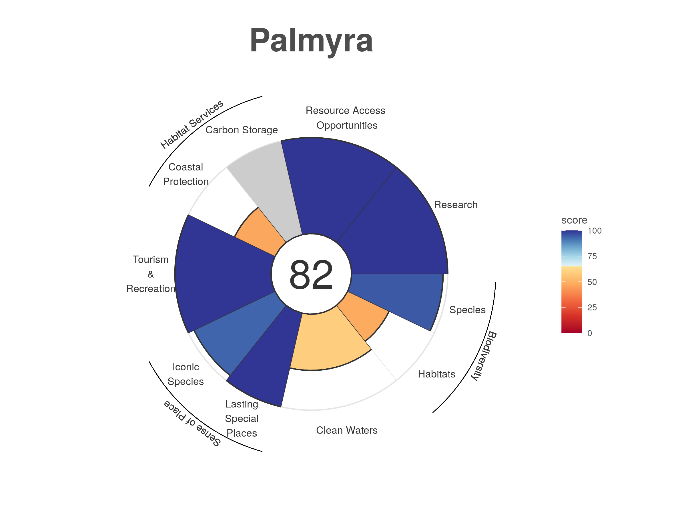

Compiled on `r date()`.

```{r setup, echo=FALSE, warning=FALSE, error=FALSE, message=FALSE}

library(knitr)
library(xtable)
library(dplyr)
library(tidyr)
library(ggplot2)
library(tidyverse)
library(here)

options(knitr.kable.NA = '')
```

```{r data-layer-function, include=F, warning=F, message=F}
# Data and functions to list data layers in each goal
layers  <- read.csv(here("documents/metadata_documentation/layers_region_base.csv"))
targets <- read.csv(here("documents/metadata_documentation/layers_region_targets.csv"))

# Data layers function
data_layers <- function(dimension, goal) { 
  # goal = "ICO"; dimension=c("status", "trend")
  
  st <- targets[targets$goal == goal, ]
  st <- st[st$dimension %in% dimension, ]
  
st <- st %>%
  select(layer) %>%
  unique()

st_layers <- filter(layers, layer %in% st$layer) %>% 
  mutate(info = sprintf("<u>%s</u> (%s): %s", name, layer, description))
cat(paste(st_layers$info, collapse="\n\n"))
}
```

***
Effective management of marine systems requires quantitative assessments of ocean health. To assess the ocean condition of Palmyra Atoll a collaborative effort was undertaken between The Nature Conservancy’s (TNC) Palmyra 4site team and the University of California, Santa Barbara’s National Center for Ecological Analysis and Synthesis (NCEAS). The Ocean Health Index (OHI) framework was used to assess Palmyra Atoll. Palmyra is a mostly uninhabited island in the Line Islands Archipelago halfway between Hawaii and American Samoa. The island is a National Wildlife Refuge administered by the U.S. Fish and Wildlife Services and was purchased by The Nature Conservancy in 2000. Specifically, we assessed the performance of 7 goals: Biodiversity, Clean Waters, Habitat Services, Research, Resource Access Opportunities, Sense of Place, and Tourism and Recreation. Using best available data and locally relevant reference points, each goal was scored on a scale of 0-100. Goal scores were then averaged to obtain an overall health score for the island. The overall score for Palmyra was 81, with goal scores ranging from 43 for the Habitat Services goal to 100 for the Research, Resource Access Opportunities, and Tourism and Recreation goals.      

The Palmyra OHI+ [Github repository](https://github.com/OHI-4site/pal-prep) contains all the data and scripts used to conduct the Palmyra assessment. Future researchers can use this resource to build upon this assessment as better data become available and goal models evolve to better assess the status of the marine and terrestrial environments around Palmyra. Furthermore, the repository promotes transparent and open research, as well as more streamlined collaboration (Stewart Lowndes *et al.*, 2017).

# Applying the Ocean Health Index (OHI) to Palmyra

The Ocean Health Index (OHI) is a scientific framework used to measure how healthy oceans are. Understanding the state of our oceans is a first step towards ensuring they will continue to benefit humans now and in the future. The Ocean Health Index was originally launched in 2012, with assessments conducted every year thereafter, to assess the condition of our global oceans.  The global assessment describes how well 220 countries (and some territorial regions) are  sustainably managing 10 goals which represent the full suite of benefits that people want and need from the ocean. These goals include: Artisanal Fishing Opportunity, Biodiversity, Carbon Storage, Clean Waters, coastal Livelihoods and Economies, Coastal Protection, Food Provision, Natural Products, Sense of Place, and Tourism and Recreation.    

Each goal is scored from 0 to 100, and the full suite of goal scores are averaged to obtain an overall index score. Goal scores are calculated as the average of current status (current condition relative to a reference point) and likely future status.  Likely future status is the current status modified by the following dimensions: pressures predicted to reduce status (e.g., increasing SST, fishing pressures, invasive species);  resilience variables that mitigate pressures (e.g., effective fishing management, protected areas);  and recent trends in status.     

In addition to the global assessment, OHI assessments have been completed at smaller regional scales for over 36 countries and regions, referred to as OHI+ assessments.  For more information about the philosophy of the Ocean Health Index and model development see http://ohi-science.org/ohi-global/.    

To assess the condition of Palmyra Atoll’s ocean resources, an OHI+ assessment was conducted as part of a collaboration between The Nature Conservancy’s Palmyra 4site team and the University of California, Santa Barbara’s National Center for Ecological Analysis and Synthesis (NCEAS). Here we report the conclusions from our analysis, and describe how we modified the goal models to reflect locally relevant management concerns.    
<br>   
<center>

</center>

# Palmyra Atoll 

## Location

Palmyra Atoll is located in the Northern Line Islands in the west-central Pacific Ocean, 960 miles (1,545 km) southwest of Honolulu, Hawai'i. Palmyra is comprised of a number of islets and while estimates of the atoll's size vary, studies approximate the land area at about 250 hectares (Hathaway *et al.*, 2011). Most of the islets are heavily vegetated and have an average elevation of 6 feet (2 meters) above sea level. The islets are arranged in a horseshoe pattern around four lagoons surrounded by coral reef. The terrestrial ecosystem supports what have been considered some of the best remaining protected *Pisonia grandis* forest and large colonies of sea birds, including the second largest colony of red-footed boobies (*Sula sula*) in the world, as well as significant numbers of migratory shore birds (Hathaway *et al.*, 2011).   

<center>
.](images/Palmyra_Atoll_map.png){width=56%} .](images/Aerial-Palmyra-Atoll.jpg){width=43%}
</center>
***Figure 2.1. Palmyra Atoll.** Palmyra Atoll's location in the west-central Pacific is shown relative to the rest of the world (left) and a close up satellite image of the island (right).   
Sources: Wikimedia Commons 2011, The Nature Conservancy, 2020*
<br> 

## History

Palmyra Atoll was first sighted in 1798 by an American ship; however, the atoll was not discovered and named until 1802 when the American ship *Palmyra* made landfall. The atoll was annexed by the Kingdom of Hawai'i in 1862 and by Britain in 1889. In 1898 the United States annexed Palmyra as part of the Hawaiian Islands territory (Tikkanen, 2010).       

In the 1940s, the U.S. Navy stationed 6,000 sailors in the atoll. They dredged a seaplane runway which merged the atoll’s two western lagoons into one, and a causeway was built on the remaining reef. The sailors also joined three of the islands into one and built a runway about one mile long, which the U.S. Air Force used until 1961 (U.S. Department of Interior [DOI], 2020).   

The Nature Conservancy (TNC) purchased Palmyra Atoll in December 2000 from the Fullard-Leo family to protect its unique ecosystem and establish a center for scientific investigation (Wegmann, 2020). It was declared a U.S. National Wildlife Refuge in January 2001, and includes submerged lands and associated waters out to 12 nautical miles from the atoll (U.S. Fish and Wildlife Service [USFWS], 2017). Palmyra was designated part of the Pacific Remote Islands Marine National Monument on January 6, 2009, which includes Palmyra Atoll National Wildlife Refuge within its boundaries, and protects it further out to 50 nautical miles (The Nature Conservancy [TNC], 2020).      


## Natural History

Palmyra’s native vegetation supports one of the largest remaining undisturbed stands of Pisonia beach forest in the Pacific, including native varieties of ferns and shrubs. The atoll’s rich intertidal sand and mudflats provide attractive resting and feeding grounds for migratory seabirds and shorebirds. Sooty terns, red- and white-tailed tropicbirds, several species of boobies, great frigate birds, and white terns are some of the common bird species that nest on Palmyra. The second largest red-footed booby colony in the world is found on the atoll, and more than 200 bristle-thighed curlews, whose worldwide population estimate is only 6,000 individuals, spend their winters on Palmyra. Palmyra’s waters are home to stony corals, giant clams, and over 400 species of fish, and are frequented by Pacific bottle-nosed dolphins, spinner dolphins, and melon-headed whales. Threatened green and endangered hawksbill turtles are also found within the lagoon and waters surrounding the atoll. Large populations of the world’s largest land invertebrate, the coconut crab, inhabit Palmyra’s forests along with other crabs (USFWS, 2016).          

Rainforest once dominated the atoll, but copra farming, black rats, and deforestation by the U.S. military during World War II reduced Palmyra’s rainforest to a few patches. Thick groves of introduced coconut palms took its place, which are ill-suited for seabirds. There was a resurgence of native bird and plant life after rats were eradicated from Palmyra in 2011, and a major native rainforest restoration project is now underway. The aim of this project is to flip forest dominance and restore ecological balance to the atoll, which will maximize the seabird-driven nutrient cycle and increase terrestrial and marine ecosystem resilience to climate change impacts (TNC, 2020).      

***

# Summary Results

The health of the Palmyra atoll is critical to The Nature Conservancy’s core mission to protect endangered marine wilderness and to support research and conservation science.  Palmyra had an overall Ocean Health Index score of 81 (Figure 3.1 and Table 3.1), suggesting the region’s marine and coastal resources are in fairly good condition (Figure 3.1).   Seven goals/sub-goals scored above a 90, with four goals receiving perfect scores (Lasting Special Places, Research, Resource Access Opportunities, and Tourism and Recreation). The designation of the island and offshore areas as fully protected reflects The Nature Conservancy’s commitment to protecting the health of Palmyra's ecosystems. Furthermore,  the population and  visitors allowed on the island are restricted, and fishing and tourism activities are well regulated and managed.   

There is room for some improvement, however. The Habitat, Coastal Protection, and Carbon Storage sub-goals scored lower than 50. These sub-goals are closely linked because they depend on the healthy habitats, specifically the condition of coral reefs (Coastal Protection) and rainforests (Carbon Storage). While Palmyra is often lauded for having pristine coral reefs, there is significant degradation of the back reef and the lagoon which negatively impact the coral habitat score and thus the coastal protection score. Without a concerted effort to restore live coral in the back reef and the lagoon the coral habitat score is likely to remain fairly constant over time. Coconut palm plantations have a significant negative impact on the native rainforest and while management plans to remove these palms and replant native tree species exists, they are not far along. This is the largest contributing factor to the low score for rainforest habitats and thus the carbon storage score. As replacement of coconut palms continues on the island, both of these scores are expected to steadily increase over time.        

<br>   

***Figure 3.1 OHI+ Palmyra Results.** Each goal and sub-goal of the Palmyra Ocean Health Index assessment is represented by a petal. The length of each petal corresponds to the score (0-100), with longer petals indicating higher scores. The color of the petals also correspond to the scores with red indicating lower scores and blue indicating higher scores. Scores of 'NA' are shown in grey. The overall index score is shown in the center of the plot.*
<br>   
***Table 3.1. Results for each goal and sub-goal in the Palmyra OHI+ assessment.** Goal, and sub-goal, scores, as well as current status and predicted future status. Where 'Status' is the current status relative to the reference point; 'Future' is the likely future status based on the trend, pressures, and resilience; and 'Score' is the final goal or sub-goal score reflected in Figure 3.1.*   
<br>   
```{r score-table, echo=F, message=F, warning=F}

goals <- read_csv(here("region/conf/goals.csv")) %>% 
  dplyr::select(goal, name, description)

scores <- read_csv(here("region/scores.csv")) %>% 
  filter(dimension == "score" | dimension == "future" | dimension == "status") %>% 
  dplyr::select(goal,dimension,score) %>% 
  pivot_wider(id_cols ="goal", names_from = "dimension", values_from = "score") %>% 
  filter(goal != "Index") %>% 
  inner_join(.,goals, by = "goal") %>% 
  mutate(parent = c("", "Habitat Services", "Habitat Services", "",
                    "Biodiversity", "", "Sense of Place",
                    "Sense of Place", "", "", "", "Biodiversity", "")) %>% 
  dplyr::select('Goal/Sub-goal' = name, 'Parent Goal' = parent, Status = status, Future = future, Score = score, Description = description) %>% 
  arrange(desc(Score))

kable(scores, align = "l")
```

***
<br>   

# Methods and Results

## Goals Included in Palmyra OHI+ Assessment:

Given that Palmyra is a nearly uninhabited island, several of the OHI goals were not relevant to this region (e.g., Livelihoods and Economies). Furthermore, one of the stated goals of The Nature Conservancy for Palmyra is to serve as a “platform for applied conservation science” (TNC, 2020), which resulted in the creation of a new goal, Research, which captures the degree to which Palmyra provides access to research opportunities. Given these considerations, we modified the OHI framework to include the following goals (Table 3.1): Sense of Place (comprised of Lasting Special Places and Iconic species sub-goals), Resource Access Opportunities (a modified version of Artisanal Opportunities in the original framework), Research (not included in the original framework), Tourism & Recreation, Biodiversity (comprised of Species Condition and Habitat sub-goals), Clean Waters, and Habitat Services (Coastal Protection and Carbon Storage sub-goals).  

### Biodiversity

<span style="color: #f2cf4a; font-family: Arial, sans-serif; font-size: large;">Score = 71.51</span>

People value biodiversity for its existence value. This goal assesses the conservation status of species based on the best available data through two sub-goals: Species and Habitats. Species were assessed because they are what one typically thinks of in relation to biodiversity. Because only a small proportion of marine species worldwide have been mapped and assessed, we also assessed habitats as part of this goal, and considered them a proxy for the condition of the broad suite of species that depend on them. We calculate each of these sub-goals separately and weight them equally when calculating the overall goal score.   

#### Habitats (HAB)

<span style="color: #f2cf4a; font-family: Arial, sans-serif; font-size: large;">Score = 47.85</span> 

The Habitats sub-goal measures the average condition of habitats present on the island that provide critical habitat for a broad range of species. This sub-goal is considered a proxy for the condition of the broad suite of species on Palmyra. The atoll currently supports one of the best remaining coastal strand forests in the world (Island Conservation, 2020). Given the importance of this ecosystem, and the tight linkage between land and ocean environments, both terrestrial and marine habitats are included in this assessment.     

**Current Status**  

The Habitats sub-goal includes coral reef habitats and rainforest habitats. A score is calculated for each habitat and then the habitat scores are averaged, with area weighting, to obtain an overall status score.   
<br>   
*Coral Reefs*   

Four zones were used to calculate the coral reef status: back reef, reef crest, fore reef, and lagoon. 

Original raw data included 10 different zones, as shown in the map in Figure 4.1A. The following zones were grouped together to form the four reef zones, as shown on the map in Figure 4.1B:    

 - Back Reef: Not grouped with any other zone   
 - Reef Crest: Reef Crest and Fore Reef  
 - Fore Reef: Bank/Shelf and Bank/Shelf Escarpment      
 - Lagoon: Lagoon and Channel  

<center>
{width=70%} {width=70%}  
</center>
***Figure 4.1 Coral zones.** Map A (top) displays coral zones as shown in the raw data and map B (bottom) shows the coral zones reclassified for this assessment.*
<br>     
The fore reef is reassigned to part of the reef crest to better reflect the position of those data points on the reef. The Bank/Shelf and Bank/Shelf Escarpment are then grouped together and renamed as the fore reef with an additional designation to differentiate the western fore reef and the eastern fore reef. Based on a map of Palmyra, the longitude line 162.075 was used to divide the fore reef into western and eastern. These groupings follow the zones delineated by NOAA in the Coral Reef Ecosystems Monitoring Report for the Pacific Remote Islands Marine National Monument, available [here](https://repository.library.noaa.gov/view/noaa/23421).  
 
Coral condition is based on the percent of live coral cover in each of the zones. The reference point, or target live coral cover range, for each zone is:   

 - Back Reef:  10-50% live coral cover  
 - Reef Crest: 10-50% live coral cover      
 - Fore Reef:  50-90% live coral cover     
 - Lagoon:     10-50% live coral cover       

The western and eastern fore reef both have the same reference point. Reference points were established based on input from scientists at The Nature Conservancy.    

Coral reef status is first calculated for each zone $x_{zone}$. The status is calculated as the area of the reef zone falling within or above the reference point category divided by the total area of the reef zone (Equation 4.1):        

$$
x_{zone}~=~\frac { A_{ref} } { A_{total} },  ~~(Eq~4.1) 
$$  

Where $A_{ref}$ is the area of the reef zone falling within or above the reference point category and $A_{total}$ is the total area of the reef zone. For the status calculation we adjust the area of the lagoon to include only the area of the lagoon where coral can reasonably grow. Other zones are not area adjusted due to incomplete knowledge and data. Ideally the area of all zones would be adjusted to include only the area where coral can grow and thrive.            

The overall status score $x_{coral}$ is calculated as the area weighted mean of the status score for each zone (Equation 4.2). Here we use the total area of the lagoon.   

$$
x_{coral}~=~\frac { \displaystyle\sum _{ i=1 }^{ N }{ { A }_{ i }{ x }_{ i } } } { \displaystyle\sum _{ i=1 }^{ N } { A }_{ i } },  ~~(Eq~4.2) 
$$
where $A_{i}$ is the area of zone $i$ and $x_{i}$ is the status score for each zone $i$ as calculated in Equation 4.1.   
<br>   
*Rainforests*   

The rainforest condition is based on the current land area of the rainforest relative to the total potential area of rainforest. Invasive coconut palms (*Cocos nucifera*) have replaced much of the native rainforests, but since purchasing the island in 2000 TNC is restoring native forest through ongoing coconut palm removal activities.          

The raw data included four vegetation categories: native forests, *Scaevola*, non-vegetated areas, and *Cocos nucifera* (coconut palm). The native forest and *Scaevola* categories were grouped together to find the total forest land area. Non-vegetated areas were excluded from the analysis.   

The rainforest habitat status $x_{forest}$ is calculated based on the area of rainforest currently present compared to the area of rainforest that would exist once 95% of the historic area of coconut palm has been removed (Equation 4.3). The historic area is the area of the rainforest in 2001, which is the closest estimate available to the extent of the rainforest when TNC first purchased the island in 2000.    

$$
x_{forest}~=~ \frac { A_{current} } { A_{potential} }, ~~(Eq ~4.3) 
$$  

The current rainforest area ($A_{current}$) km^2^ is based on the Burnett, M.W. *et al.* 2019 study where forest is defined as the total area of the *Scaevola* and native forest categories.    

The potential rainforest area ($A_{potential}$) km^2^ is based on a 2001 satellite image showing approximately 43% of the islands are dominated by coconut plantations and 48.2% of the islands are dominated by other vegetation communities as discussed in the USGS Terrestrial Management Plan (Hathaway *et al.*, 2011). The remaining 8.8% is assumed to be non-vegetated and is excluded from this analysis. The total land area ($A_{total}$) used in these calculations (2.46 km^2^) was derived from a study completed in 2000 (referenced in Burnett *et al* 2019), which is the closest land estimate we could obtain to the 2001 satellite image. The potential rainforest area is calculated as the land area added once 95% of the historic palm plantations are removed plus the original 48.2% of land area that was dominated by rainforests (Equations 4.4 - 4.6).     

$$
A_{potential}~=~A_{added}~+~A_{original} , ~~(Eq ~4.4)
$$

And where   

$$
A_{added}~=~0.95~*~(0.43~*~A_{total}), ~~(Eq~ 4.5)
$$   
$$
A_{original}~=~0.482~*~A_{total}, ~~(Eq~4.6)
$$   

**Trend** 
<br>   
*Coral Reefs* 

The benthic habitat mapping project used to calculate the current status was the first study of its kind on Palmyra Atoll. As no previous studies exist to estimate historic live coral cover across the different reef zones, an estimate of coral trend was derived using data from the 2019  OHI global assessment. The OHI global trend data are calculated as a linear trend in coral condition, on a per country basis across all available data from 1975-2006. More information on the coral trend method can be found in the [OHI Global Methods](http://htmlpreview.github.io/?https://github.com/OHI-Science/ohi-global/published/documents/methods/Supplement.html#62_biodiversity) documentation, Section 6.2.1. No coral trend was available for Palmyra in the OHI global assessment, so we used  the average trend observed for coral reef habitats for all countries in Micronesia.
<br>   
*Rainforests* 

The trend in rainforest condition is the predicted change in forest area during a five year period. This was estimated using a linear regression model of forest area from 2005, 2010, 2016, and 2019.   
<br>   
**Data**   

_Status and trend_
<br>   
```{r hab-data-st, results="asis", echo=FALSE}
data_layers(goal="HAB", dimension=c("status", "trend"))
```
<br>   
_Pressure_
<br>   
```{r hab-data-p, results="asis", echo=FALSE}
data_layers(goal="HAB", dimension=c("pressure"))
```
<br>   
_Resilience_
<br>   
```{r hab-data-r, results="asis", echo=FALSE}
data_layers(goal="HAB", dimension=c("resilience"))
```
<br>     
**Data Citations**
<br>   
*Coral Reefs* 

Data to calculate the current status of coral reefs were gathered from National Centers for Coastal Ocean Science (NCCOS) benthic habitat mapping project for Palmyra Atoll, completed in 2011. The data are available for download [here](https://products.coastalscience.noaa.gov/collections/benthic/e58palmyra/#horizontalTab3).    

Date Downloaded: June 30, 2020

Citation: U.S. Department of Commerce, National Oceanic and Atmospheric Administration, National Center for Coastal Ocean Sciences. (2011). Palmyra Habitat Maps [Data file]. Retrieved from https://products.coastalscience.noaa.gov/collections/benthic/e58palmyra/
<br>   
*Rainforests* 

Data to calculate the current status of rainforests were gathered from a recent publication on coconut palms in Palmyra completed in 2019. Data were downloaded from Table A1, available [here](https://www.tandfonline.com/doi/figure/10.1080/01431161.2019.1594440?scroll=top&needAccess=true). 

Date Downloaded: July 8, 2020

Citation: Burnett, M.W. *et al.* (2019). "Quantifying coconut palm extent on Pacific islands using spectral textural analysis of very high resolution imagery". *International Journal of Remote Sensing* 40(19): 7329-7355   
  [Available here](https://www.tandfonline.com/doi/epub/10.1080/01431161.2019.1594440?needAccess=true). 
<br>     
<u>2001 Reference Point:</u>   
The 2001 reference point comes from a satellite image of the island that is discussed in the 2011 Terrestrial Forest Management Plan.  

Citation: Hathaway, S.A., McEachern K., & Fisher, R.N. (2011). "Terrestrial Forest Management Plan for Palmyra Atoll". U.S. Geological Survey Open-File Report 2011-1007.  
  [Available here](https://permanent.fdlp.gov/gpo119875/ofr20111007.pdf)
<br>     
There have been no studies using the same methodology to track the area of forests and coconut palm on the island over time. Therefore, data to calculate the trend in rainforest condition are estimated from three additional studies that included some estimate of percent cover of coconut palms and total land area.
<br>   
<u>2005 Data:</u>      
The 2005 data was obtained from Alex Wegmann at The Nature Conservancy on July 31, 2020. Shapefiles were compiled as part of Alex Wegmann's PhD dissertation.
<br>   
<u>2010 Data:</u>   
The 2010 data is estimated from a study on invasive rats that quantified the percent of land area on each islet occupied by *Cocos nucifera* (Table 1).    

Citation: Lafferty, K.D. et al. (2010). "Stomach nematodes (*Mastophorus muris*) in rats (*Rattus rattus*) are associated with coconut (*Cocos nucifera*) habitat at Palmyra Atoll. *Journal of Parasitology* 96(1): 16-20.   
  [Available here](https://bioone.org/journals/Journal-of-Parasitology/volume-96/issue-1/GE-2180.1/Stomach-Nematodes-Mastophorus-muris-in-Rats-Rattus-rattus-Are-Associated/10.1645/GE-2180.1.full)
<br>     
<u>2016 Data:</u>   
The 2016 data is estimated using a U.S. Geological Survey vegetation community mapping project for Palmyra Atoll. Vegetation maps were completed in October 2016 and published in June 2019. Data is available for download [here](https://www.sciencebase.gov/catalog/item/5c66fc5be4b0fe48cb3aca49).   

Date Downloaded: July 2, 2020  

Citation: Struckhoff, M.A., (2019). Woody species crown and vegetation community data, Palmyra Atoll, 2016: U.S. Geological Survey data release, https://doi.org/10.5066/P9GMPVIO.  
<br>   

#### Species 

<span style="color: #f2cf4a; font-family: Arial, sans-serif; font-size: large;">Score = 95.16</span>

The Species sub-goal aims to assess the average condition of species in Palmyra. Both marine and terrestrial species are included in this sub-goal.    
 
**Current Status** 

A list of species occurring in Palmyra was created using IUCN range maps and supplemented with fish and bird lists obtained from The Nature Conservancy for a total of 587 species. Species condition was pulled from the IUCN Red List (IUCN 2020).   

The reference point for the Species sub-goal is all species have an IUCN status of "Least Concern".   

Threat weights, were assigned based on the IUCN threat categories status of each species, following the weighting schemes developed by Butchart *et al* (2007) (Table 4.1). For the purposes of this analysis, we included only data for extant species for which sufficient data were available to conduct an assessment. We did not include Data Deficient species.   We assessed species following previously published guidelines (Schipper *et al.* 2008; Hoffmann *et al.* 2010).   
<br>   
***Table 4.1. Risk scores for assessment of species status based on IUCN risk categories.***

| Risk Category   | IUCN code | Risk Score |
|-----------------|-----------|------------|
| Least Concern   |     LC    |  0.0       |  
| Near Threatened |     NT    |  0.2       |
| Vulnerable      |     VU    |  0.4       |
| Endangered      |     EN    |  0.6       |
| Critically Endangered | CR  |  0.8       |
| Extinct         |     EX    |  1.0       |   
  
The species fall within 10 different taxonomic classes and to avoid overweighting species with many species, status was first calculated for each class as the average of the extinction risk scores. An overall extinction risk status was estimated by averaging the extinction risk score of all 10 classes. Finally, the status $x_{spp}$ is rescaled so a risk factor of 0.75 is equal to zero (Equation 4.7):      

$$
x_{spp}~=~ \frac { (0.75~-~risk_{avg}) } {0.75}, ~~~~(Eq ~4.7)
$$   

Where $risk_avg$ is the average extinction risk score, found by averaging the mean extinction risk score of all 10 classes. 

This assigns a score of 0 when 75% species are extinct, a level comparable to the five documented mass extinctions (Barnosky *et al.* 2011) and would constitute a catastrophic loss of biodiversity.
<br>    
**Trend** 

The species trend is calculated using data the IUCN provides for current and past assessments of species. Discrete species assessments between 1965-2020 are used to estimate annual change in IUCN risk status for each species. Species trend is evaluated for species with more than two past assessments. Trend for species with less than two past assessments is estimated using the population trend noted in species history information. We then summarize these species trend values for each region using the same general approach used to calculate status.
<br>   
**Data**

_Status and trend_
<br>   
```{r spp-data-st, results="asis", echo=FALSE}
data_layers(goal="SPP", dimension=c("status", "trend"))
```
<br>   
_Pressure_
<br>   
```{r spp-data-p, results="asis", echo=FALSE}
data_layers(goal="SPP", dimension=c("pressure"))
```
<br>   
_Resilience_
<br>   
```{r spp-data-r, results="asis", echo=FALSE}
data_layers(goal="SPP", dimension=c("resilience"))
```
<br> 
**Data Citations**   

The original species list, species condition and historic assessments are based on the IUCN Red List.    

Date Accessed: June 9, 2020   

Citation: IUCN 2020. IUCN Red List of Threatened Species. Version 2020-1 <www.iucnredlist.org>.  

Additional species lists were provided by Alex Wegmann at The Nature Conservancy on July 8, 2020
<br>   

### Clean Waters

<span style="color: #f2cf4a; font-family: Arial, sans-serif; font-size: large;">Score = 58.57</span> 

People value marine waters that are free of pollution and debris for aesthetic and health reasons. Although Palmyra has a limited population, people are sensitive to pollution and debris in areas they access for recreation or other purposes as well as for simply knowing that clean waters exist. Due to limited data availability, this goal includes two sources of pollution - marine debris and soil contamination. The main source of pollution on the island is marine debris from fishing aggregation devices (FADs) and the military history of the island has left a legacy of soil contamination. The overall Clean Waters score is the geometric mean of these two layer scores. This goal scores highest when the contamination level is zero.
<br>   
**Current Status**   
The current status for the Clean Waters goal is the geometric mean of the status of the two layers: marine debris and soil contamination.
<br>   
*Marine Debris*  

Marine debris current status is calculated based on the number of annual grounded FADs. The reference point for marine debris is to reduce FAD groundings by 50% of the highest annual recorded number of groundings between 2009 and 2019. The highest annual groundings occurred in 2016, with 12 groundings, making the reference point 6 annual FAD groundings. Any year where six or less FAD groundings were recorded received a perfect score.   

The current status $x_{debris}$ is scaled between 0-1 by subtracting the reference point from the number of groundings and then dividing by the reference point (Equation 4.8):        

$$
x_{debris}~=~ \frac { (fad_{y}~-~fad_{ref}) } { fad_{ref} }, ~~~(Eq ~4.8)
$$   

Where $fad_{y}$ is the yearly number of recorded FAD groundings and $fad_{ref}$ is the reference point number of 6 annual FAD groundings.  

$x_{debris}$ is higher with greater levels of marine debris. $x_{debris}$ is used as a pressure layer. The final status layer for the Clean Waters goal is the inverse of $x_{debris}$,    1 - $x_{debris}$.
<br>   
*Soil Contamination*   

The current status is based on the observed concentration of each pollutant (mg/kg wet weight). A total of 155 sites were sampled in 2008 and an additional 41 sites were sampled in 2010. At each site concentrations were recorded for 13 pollutants: antimony (Sb), arsenic (As), chromium (Cr), cobalt (Co), copper (Cu), iron (Fe), lead (Pb), manganese (Mn), nickel (Ni), phosphorus (P), sulfur (S), titanium (Ti), and zinc (Zn). However, only 9 elements are included in the analysis. Iron is generally considered non-toxic and titanium, sulfur, and phosphorus were detected but do not have established Threshold Effects Levels (TELs) or ecological soil screening levels (Eco-SSLs); therefore, they were excluded from the analysis.     

Two different reference levels were used to scale the contamination scores from 0-1. A TEL was used to scale values from 0 - 0.5. Any observed concentration equal to the TELreceived a score of 0.5. The TEL are the lower end of values below which harmful impacts are not likely to be observed. The upper end of the scores were based on the Probable Effect Level (PEL); this represents a value above which harmful impacts are likely to be observed. Any observed concentration above the PEL was assigned a score of 1.       

<u>TEL</u>   

TEL reference levels were assigned based on the TELs established by the U.S. Environmental Protection Agency for marine sediments and the lowest established Eco-SSLs for any taxonomic group. TEL and Eco-SSL values (mg/km dry weight) for the most frequently detected contaminants on Palmyra (Table 4.2) are replicated from Table 1 of Struckhoff *et al* 2018.
<br>   
***Table 4.2. Midpoint reference levels.** Threshold Effect Levels (TELs) and Ecological soil screening levels (Eco-SSLs) for the main contaminants found in soils around Palmyra. NA indicates a toxicity threshold has not been established. These values are used as the midpoint reference levels in the status calculation.*           

| Contaminant | Symbol | TEL   | Eco-SSL |
|-------------|--------|-------|---------|
| Antimony    | Sb     | NA    | 78      |
| Arsenic     | As     | 7.24  | 18      |
| Chromium    | Cr     | 52.3  | 26      |
| Colbalt     | Co     | NA    | 13      |
| Copper      | Cu     | 118.7 | 28      |
| Lead        | Pb     | 30.24 | 11      |
| Manganese   | Mn     | NA    | 220     |
| Nickel      | Ni     | 15.9  | 38      |
| Zinc        | Zn     | 124   | 46      |. 

TELs are used for marine sediments and the lowest Eco-SSL is used for soil samples. Where no TEL is established, the lowest Eco-SSL is used in its place. The table reports thresholds in mg/kg of dry weight, however most of the samples collected were made on moist samples. Struckoff *et al* 2018 notes:   

"Soil moisture values between 15 and 25% can reduce measured sample concentrations from 70 to 80% relative to lab-confirmed concentrations (U.S. Environmental Protection Agency, 2015). Given that most measurements were made on moist samples, XRF values reported above TELs or SSLs are conservative estimates of threshold exceedance."  

<u>PEL</u>   

For soil samples, the Canadian freshwater contamination PELs (mg/kg dry weight) are used (Table 4.3), as these are more conservative than the marine contamination levels. Consensus-based freshwater PELs were established in 2000. Concentrations were replicated from Table 3 in MacDonald *et al* 2000.
<br>   
***Table 4.3. Soil sample upper reference levels** Freshwater contamination Probable Effect Levels (PELs) for the main contaminants found in soils around Palmyra. These levels are used as the upper reference level for soil samples in the status calculation.*   

| Contaminant | Symbol | PEL   | 
|-------------|--------|-------|
| Arsenic     | As     | 17    |
| Chromium    | Cr     | 90    |
| Copper      | Cu     | 197   |
| Lead        | Pb     | 91.3  |
| Nickel      | Ni     | 36    |
| Zinc        | Zn     | 315   | 

Marine sediment PELs (mg/kg of dry weight) are obtained from NOAA guidelines established in 1999 (Table 4.4). These are called Effect Range Median (ERM) levels, which is the NOAA equivalent of PELs. Concentrations were obtained from Table 1 in the NOAA 1999 guidance.
<br>   
**Table 4.4. Marine sediment upper reference levels.** Marine sediment Probable Effect Levels (PELs) for the main contaminants found in soils around Palmyra. These levels are used as the upper reference level for marine sediment samples in the status calculation.*   

| Contaminant | Symbol | PEL   | 
|-------------|--------|-------|
| Arsenic     | As     | 70    |
| Chromium    | Cr     | 370   |
| Copper      | Cu     | 270   |
| Lead        | Pb     | 218   |
| Nickel      | Ni     | 51.6  |
| Zinc        | Zn     | 410   |

No PELs are available for Antimony, Colbalt, and Manganese. For these we approximated an upper limit that is one order of magnitude higher than the established TEL or Eco-SSL.      

Contaminants are scaled 0-1 using a midpoint level, (TEL or ECO-SSl) and an upper level (PELs). A status is then calculated for each site $x_{site}$ using the geometric mean of the 9 contaminants (Equation 4.9):    
$$
x_{site} = \sqrt [ 9 ]{ As~*~Cr~*~Co~*~Cu~*~Pb~*~Mn~*~Ni~*~Sb~*~Zn ~},  ~~(Eq ~4.9)
$$ 
Finally, an overall status for contamination $x_{cont}$ is found using an area weighted mean of the site status (Equation 4.10):      

$$ 
x_{cont}~=~\frac { \displaystyle\sum _{ i=1 }^{ N }{ { A }_{ i }{ x }_{ i } } } { \displaystyle\sum _{ i=1 }^{ N } { A }_{ i } }, ~~(Eq ~4.10)
$$
where $A_i$ is the area and $x_i$ is the status of contamination for each site $i$ as calculated in Equation 4.9.     

This gives high $x_{cont}$ values to years with greater levels of contamination. $x_{cont}$ is used as a pressure layer. The final status layer for the Clean Waters goal is the inverse of this$x_{cont}$,  1 - $x_{cont}$.
<br>   
**Trend**
<br>   
The trend describes the change in clean water status over a 5 year period. This value was estimated using the slope estimate (and multiplying it by 5) from a linear model estimating yearly change in the clean water status from 2014 to 2020.
<br>   
**Data**

_Status and trend_
<br>   
```{r cw-data-st, results="asis", echo=FALSE}
data_layers(goal="CW", dimension=c("status", "trend"))
```
<br>   
_Pressure_
<br>   
```{r cw-data-p, results="asis", echo=FALSE}
data_layers(goal="CW", dimension=c("pressure"))
```
<br>   
_Resilience_
<br>   
```{r cw-data-r, results="asis", echo=FALSE}
data_layers(goal="CW", dimension=c("resilience"))
```
<br>   

**Data Citations**   

*Marine Debris*   

Data to calculate the marine debris layer come from a table of FADs found ashore on Palmyra Atoll. Data were obtained from Alex Wegmann at The Nature Conservancy on July 8, 2020.
<br>   
*Soil Contamination*   

Data for this layer come from an elemental soil contamination study completed by the U.S. Geological Survey at sites on Palmyra Atoll in 2008 and 2010. Data were published in 2017 and can be accessed [here](https://www.sciencebase.gov/catalog/item/5925b2cae4b0b7ff9fb3ca3d).  

Date Downloaded: July 28, 2020   

Citation: Struckhoff, M.A., Papoulias, D.M., Orazio, C.E., Annis, M.L., Shaver, D.K. and Tillitt, D.E., 2017, Geospatial data of elemental contamination at Palmyra Atoll, 2008 and 2010: U.S. Geological Survey data release, https://doi.org/10.5066/F74F1P00
<br>   
The reference levels were obtained from the following sources:  

<u>TELs and Eco-SSLs</u>   

Citation: Struckhoff, M.A., Orazio, C.E., Tillitt, D.E., Shaver, D.K., and Papoulias, D.M. (2018). Mapping elemental contamination on Palmyra Atoll National Wildlife Refuge. *Marine Pollution Bulletin*, 128: 97-105. https://doi.org/10.1016/j.marpolbul.2017.12.065.  

<u>PELs and ERMs</u>   

Citation: MacDonald, D.D., Ingersol, C.G., and Berger, T.A. (2000). Development and Evaluation of Consensus-Based Sediment Quality Guidelines for Freshwater Contamination. *Archives of Environmental Contamination and Toxicology.* 39:20-31. DOI: 10.1007/s002440010075   
    Available [here](https://link.springer.com/content/pdf/10.1007/s002440010075.pdf)   

Citation: National Oceanic and Atmospheric Administration. (1999). Sediment Quality Guidelines developed for the National Status and Trend Program. 

### Habitat Services

<span style="color: #f2cf4a; font-family: Arial, sans-serif; font-size: large;">Score = 46.79</span> 

The Habitat Services goal measures additional services provided by habitats on Palmyra in addition to supporting biodiversity. The Habitat Services goal is made up of two equally weighted sub-goals, Carbon Storage and Coastal Protection.
<br>   

####  Carbon Storage

<span style="color: #f2cf4a; font-family: Arial, sans-serif; font-size: large;">Score = NA</span> 

The Carbon Storage sub-goal measures the health of carbon storing habitats. Highly productive coastal wetland ecosystems (e.g., mangroves, salt marshes, seagrass beds) have substantially larger areal carbon burial rates than terrestrial forests, and "Blue Carbon" has been suggested as an alternate, more manageable carbon sequestration approach. The rapid destruction of these coastal habitats may release large amounts of buried carbon back into the ocean-atmosphere system. Our focus here, therefore, is on coastal habitats because they have large amounts of stored carbon that would rapidly be released with further habitat destruction and have the highest per-area sequestration rates of any habitat on the planet. Although they are threatened, these habitats are amenable to management, conservation, and restoration efforts. We refer to this goal as carbon storage but intend its meaning to include sequestration.   

Lacking data on the carbon storage abilities of the native rainforest, we only included this goal as a placeholder. However, if future data on carbon storage becomes available, this goal can be updated.   

#### Coastal Protection

<span style="color: #f2cf4a; font-family: Arial, sans-serif; font-size: large;">Score = 46.79</span> 

The Coastal Protection sub-goal measures the health of habitats that contribute to coastal protection from storm surge, flooding, and sea level rise. In Palmyra we are considering both the coral reefs and the native rainforest.    

**Current Status**   

The Coastal Protection current status is calculated as the current condition of coastal protection habitat relative to the reference point.

The status of this goal, $x_{cp}$, was calculated to be a function of the relative health of the habitats, $k$, weighted by their area and protectiveness rank (Table 4.5), such that:

$$
x_{cp} = \frac { \displaystyle\sum _{ k=1 }^{ N }{ { (h }_{ k } } \times { w }_{ k }\times { A }_{ k }) }{ \displaystyle\sum _{ k=1 }^{ N }{ { (w }_{ k }\times { A }_{ k }) }  }, ~~(Eq. ~4.11)
$$

where, $w$ is the rank weight of the habitat’s protective ability, $A$ is the area within a region for each $k$ habitat type, and $h$ is a measure of each habitat's condition:

$$
h = \frac { C_{ c } }{ { C }_{ r } }, ~~(Eq ~4.12)
$$

where, $C_c$ is current condition and $C_r$ is reference condition. Descriptions for how $C_c$ was calculated for both rainforest and coral habitats are outlined above in the Biodiversity: Habitats sub-goal.   

The rainforest habitat extent was calculated using data from a vegetation study in 2019. The extent of coral habitat was defined as the total area of benthic habitat derived from the Palmyra Benthic Habitat Mapping Project in 2011.          

Rank weights for the protective ability of each habitat for the Global OHI ($w_{k}$) come from previous work (Tallis *et al* 2011). Although this work does not include native atoll forest as a category, we ranked it equal to mangroves or salt marshes given they occupy similar shoreline regions. 
<br>   
***Table 4.5. Coastal protectiveness ranks** Scores range from 1-4, with 4 being the most protective (Tallis et al 2011).*

Habitat | Protectiveness rank ($w$) |
------- | --------------------------|
Rainforest | 4 |
Coral reefs | 3 |
**Trend**   

The trend for this goal used the same metrics as the Biodiversity: Habitats sub-goal trend. We used the same data and approach used to calculate the coral condition trend and rainforest trend for the Biodiversity: Habitats sub-goal. An overall trend is then found using the same approach as the current status (Equation 4.11), where the trend is a function of the trend, extent, and protectiveness rank.
<br>   
**Data**   

_Status and trend_
<br>   
```{r cp-data-st, results="asis", echo=FALSE}
data_layers(goal="CP", dimension=c("status", "trend"))
```
<br>   
_Pressure_
<br>   
```{r cp-data-p, results="asis", echo=FALSE}
data_layers(goal="CP", dimension=c("pressure"))
```
<br>   
_Resilience_
<br>   
```{r cp-data-r, results="asis", echo=FALSE}
data_layers(goal="CP", dimension=c("resilience"))
```
<br>    

**Data Citations**   

Coral reef extent and condition data are the same data used in the coral habitat status layer. Coral reef data were gathered from National Centers for Coastal Ocean Science (NCCOS) benthic habitat mapping project for Palmyra Atoll, completed in 2011. The data is available for download [here](https://products.coastalscience.noaa.gov/collections/benthic/e58palmyra/#horizontalTab3).    

Date Downloaded: June 30, 2020

Citation: U.S. Department of Commerce, National Oceanic and Atmospheric Administration, National Center for Coastal Ocean Sciences. (2011). Palmyra Habitat Maps [Data file]. Retrieved from https://products.coastalscience.noaa.gov/collections/benthic/e58palmyra/
<br>   
*Rainforest Extent and Condition*

Rainforest extent and condition use the same data as the rainforest habitat status layer.   
  
The data come from Table A1 downloaded on July 8, 2020 from [here](https://www.tandfonline.com/doi/figure/10.1080/01431161.2019.1594440?scroll=top&needAccess=true).   
Citation: Burnett, M.W. *et al.* (2019). "Quantifying coconut palm extent on Pacific islands using spectral textural analysis of very high resolution imagery". *International Journal of Remote Sensing* 40(19): 7329-7355   
  [Available here](https://www.tandfonline.com/doi/epub/10.1080/01431161.2019.1594440?needAccess=true)
<br>      

### Research 

<span style="color: #f2cf4a; font-family: Arial, sans-serif; font-size: large;">Score = 100</span> 

This goal attempts to capture the aspects of the marine and terrestrial environment that support scientific research on Palmyra Atoll. Healthy ecosystems on the island support research and advance scientific understanding. The research goal is based on two equally weighted layers: employment and scientific publications.
<br>   

**Current Status**   

Current status for the research goal is the average of the layer scores for employment and scientific publications.
<br>   
*Employment*  

The employment layer is calculated based on the number of full time equivalent (FTE) positions in conservation science supported by The Nature Conservancy. The reference point for employment is five FTE positions. Status scores $x_{emp}$ are re-scaled to 0-1 by dividing the number of FTE positions by the reference point (Equation 4.13). Any value over one is given a score of one.     

$$
x_{emp}~=~ \frac { FTE_{y} } { FTE_{ref} }, ~~(Eq ~4.13)
$$  

Where $FTE_{y}$ is the number of full-time equivalent positions in year (y) and $FTE_{ref}$ is the FTE positions reference point.
<br>   

*Scientific Publications*   

The publications layer is calculated based on the number of scientific studies published about resources on Palmyra each year. The reference point is 10 annual publications. Status scores $x_{sci}$ are re-scaled to 0-1 by dividing the number of scientific publications by the reference point (Equation 4.14):     

$$
x_{sci}~=~ \frac { pubs_{y} } { pubs_{ref} },  ~~(Eq ~4.14)
$$  

Where $pubs_{y}$ is the number of scientific publications in year (y) and $pubs_{ref}$ is the number of publications reference point.
<br>   
**Trend**   

The trend describes the change in research status over a 5 year period. This value was estimated using the slope estimate (and multiplying it by 5) from a linear model estimating yearly change research status from 2014 to 2020.
<br>   
**Data**   

_Status and trend_
<br>   
```{r rs-data-st, results="asis", echo=FALSE}
data_layers(goal="RS", dimension=c("status", "trend"))
```
<br>   
_Pressure_
<br>   
```{r rs-data-p, results="asis", echo=FALSE}
data_layers(goal="RS", dimension=c("pressure"))
```
<br>   
_Resilience_
<br>   
```{r rs-data-r, results="asis", echo=FALSE}
data_layers(goal="RS", dimension=c("resilience"))
```
<br>   

**Data Citations**   

*Employment*   

Data for this layer were gathered through verbal communication with Alex Wegmann at The Nature Conservancy on July 8, 2020.
<br>   
*Scientific Publications*   

Data for this layer comes from a scientific library containing all scientific publications relating to natural resources on Palmyra Atoll. This scientific library was obtained from Alex Wegmann at The Nature Conservancy on June 17, 2020.  

### Resource Access Opportunity 

<span style="color: #f2cf4a; font-family: Arial, sans-serif; font-size: large;">Score = 100</span> 

This goal is intended to measure access to recreational fishing opportunities on Palmyra Atoll. Access to recreational fishing is mandated within the National Wildlife Refuge by the U.S. Fish and Wildlife Service. 

**Current Status**   

Current status $x_{rao}$ is based on the number of fish caught per year compared to the reference point. The reference point is up to 20 fish caught per year for sustenance fishing. The status score is scaled such that any catch three times or more than three times higher than the reference point is given a score of zero (Equation 4.15):       

$$
x_{rao}=~ \frac { (c_{y}~-~c_{ref,y}) } { s },  ~~(Eq ~4.15)
$$ 
where $c_{y}$ is the number of fish caught in year (y), $c_{ref,y}$ is the reference point catch in year (y), and $s$ is the scaling coefficient used to adjust any catch level at or higher than three times the reference point to a score of zero. Any scores higher than one are given a one and any scores lower than zero are given a zero. This method of scoring is based on The Nature Conservancy's management goals to keep fishing at or below the reference point level and reflective of the view that fishing at more than three times the reference point would cause unnecessary damage to the ecosystem.
<br>   
**Trend** 

The trend describes the change in sustenance fishing over a 5 year period. This value was estimated using the slope estimate (and multiplying it by 5) from a linear model estimating yearly change in sustenance fishing catch from 2014 to 2020.
<br>   
**Data**   

_Status and trend_
<br>   
```{r rao-data-st, results="asis", echo=FALSE}
data_layers(goal="RAO", dimension=c("status", "trend"))
```
<br>   
_Pressure_
<br>   
```{r rao-data-p, results="asis", echo=FALSE}
data_layers(goal="RAO", dimension=c("pressure"))
```
<br>   
_Resilience_
<br>   
```{r roa-data-r, results="asis", echo=FALSE}
data_layers(goal="RAO", dimension=c("resilience"))
```
<br>   
**Data Citations**   

Data to inform this layer were obtained via email from Alex Wegmann at The Nature Conservancy and Stephan Kropidlowski from U.S. Fish and Wildlife Service on August 17, 2020.  

### Sense of Place

<span style="color: #f2cf4a; font-family: Arial, sans-serif; font-size: large;">Score = 96.74</span> 

This goal attempts to capture the aspects of the coastal and marine system that people value as part of their cultural identity. This definition includes people living near the ocean and those who live far from it but still derive a sense of identity or value from knowing particular places or species exist. While there are only a small handful of residents on Palmyra, the island's pristine ecosystems are valued by scientists, researchers, and conservationists, among others, including the general public. This goal is calculated using two equally weighted sub-goals: iconic species and lasting special places.        

#### Iconic Species

<span style="color: #f2cf4a; font-family: Arial, sans-serif; font-size: large;">Score = 93.48</span> 

Iconic species are those that are relevant to local cultural identity through their relationship to one or more of the following: 1) traditional activities such as fishing, hunting or commerce; 2) local ethnic or religious practices; 3) existence value; and 4) locally-recognized aesthetic value (e.g., tourist attractions/common subjects for art such as whales). Ultimately, almost any species can be iconic to someone, and so the intent with this goal was to focus on those species widely seen as iconic from a cultural or existence value (rather than a livelihood or extractive reason).   

A primary iconic species list  for Palmyra was gathered based on species listed on the U.S. Fish and Wildlife Service webpage for the [Palmyra Atoll National Wildlife Refuge](https://www.fws.gov/refuge/palmyra_atoll/). This list was supplemented with species identified as globally iconic (World Wildlife Fund Flagship species and Priority species) or regionally iconic (based upon World Wildlife Fund regional/local priority species and nation-specific lists) from the OHI Global Assessment. A total of 23 species were included in the iconic species list.        

**Current Status**

A score was assigned for each species based on its conservation status which is 1- extinction risk based on IUCN data (refer to Table 4.1).   

The reference point is 100% of species have a status of "Least Concern". The status $x_{ico}$ is found by averaging the IUCN category score for each of the species on the iconic species list (Equation 4.16):      

$$
x_{ico}~=~ \frac { \displaystyle\sum_{ i=EX }^{ LC }{ S_{i}~*~w_{i} }  }{ \displaystyle\sum_{ i=EX }^{ LC }{ S_{i} }  }, ~~(Eq. ~4.16)
$$

where for each IUCN threat category $i$, $S_{i}$ is the number of assessed species and $w_{i}$ is the score (Table 4.6).
<br>   
**Trend**

The trend describes the change in iconic species status over a 5 year period. This value was estimated using the slope estimate (and multiplying it by 5) from a linear model estimating the change in species extinction risk from 2014 to 2020.
<br>   
**Data**   

_Status and trend_
<br>   
```{r ico-data-st, results="asis", echo=FALSE}
data_layers(goal="ICO", dimension=c("status", "trend"))
```
<br>   
_Pressure_
<br>   
```{r ico-data-p, results="asis", echo=FALSE}
data_layers(goal="ICO", dimension=c("pressure"))
```
<br>   
_Resilience_
<br>   
```{r ico-data-r, results="asis", echo=FALSE}
data_layers(goal="ICO", dimension=c("resilience"))
```
<br>   

**Data Citations**   

A list of iconic species was created based on species listed on the U.S. Fish and Wildlife Service webpage for the Palmyra Atoll National Wildlife Refuge. 

Data Accessed: June 4, 2020   

Citation: U.S. Fish and Wildlife Service. (2016, January 14). Wildlife and Habitat. Retrieved from <https://www.fws.gov/refuge/Palmyra_Atoll/wildlife_and_habitat/index.html> 
<br>   
Additional iconic species and species status were derived from the IUCN Red List.    

Date Accessed: June 9, 2020   

Citation: IUCN 2020. IUCN Red List of Threatened Species. Version 2020-1 <www.iucnredlist.org>.  
<br>      

#### Lasting Special Places

<span style="color: #f2cf4a; font-family: Arial, sans-serif; font-size: large;">Score = 100</span> 

The lasting special places sub-goal focuses on geographic locations that hold particular value for aesthetic, spiritual, cultural, recreational or existence reasons (TRC 2004). For this sub-goal, we assume areas that are protected indicate special places (i.e., the effort to protect them suggests they are important places). Clearly this is an imperfect assumption but in many cases it will be true. For Palmyra we included  offshore protected areas located within three nautical miles of the shoreline and inland protected areas including the entire island. 
<br>   
**Current Status** 

The current status is calculated by averaging the score for protected areas offshore $x_{offshore}$ and inland $x_{inland}$. The reference point is 99% of all offshore and inland areas protected. The status for offshore and inland protected areas is found by comparing the percentage of the area protected to the reference point (Equations 4.17, 4.18):    

$$
x_{offshore}~=~ \frac { pa_{offshore} } { pa_{offshore, ref} }, ~~(Eq ~4.17)
$$   
<br>    
$$
x_{inland}~=~ \frac { pa_{inland}} { pa_{inland, ref} },  ~~(Eq ~4.18)
$$    

Where $pa_{offshore}$, $pa_{inland}$ is the percentage of offshore and inland areas, respectively, that is protected and $pa_{offshore,ref}$, $pa_{inland,ref}$ are the reference point percentages of protected areas offshore and inland, respectively.  

Finally, the status of offshore and inland areas are averaged to find the overall status.
<br>   
**Trend**

The trend describes the change in offshore and inland protected areas over a 5 year period. This value was estimated using the slope estimate (and multiplying it by 5) from a linear model estimating yearly change in the percent of offshore and inland protected areas from 2014 to 2020.
<br>   
**Data**   

_Status and trend_
<br>   
```{r lsp-data-st, results="asis", echo=FALSE}
data_layers(goal="LSP", dimension=c("status", "trend"))
```
<br>   
_Pressure_
<br>   
```{r lsp-data-p, results="asis", echo=FALSE}
data_layers(goal="LSP", dimension=c("pressure"))
```
<br>   
_Resilience_
<br>   
```{r lsp-data-r, results="asis", echo=FALSE}
data_layers(goal="LSP", dimension=c("resilience"))
```
<br>   

**Data Citations**   

Data were obtained verbally from Alex Wegmann at The Nature Conservancy on June 29, 2020. 

### Tourism and Recreation

<span style="color: #f2cf4a; font-family: Arial, sans-serif; font-size: large;">Score = 100</span> 

This goal is intended to measure access to tourism and recreation on Palmyra Atoll. Although the atoll is protected, a limited number of private tourists visit the island each year via boat.   

**Current Status**   

Current status $x_{tr}$ is based on the number of private visiting vessels per year compared to the reference point. The reference point is up to 6 visiting vessels per year. The status score is scaled such that any year with vessel visits three times or more than three times higher than the reference point is given a score of zero (Equation 4.19):       

$$
x_{tr}~=~ \frac { (v_{y}~-~v_{ref,y}) } { s },  ~~(Eq ~4.19)
$$
where $v_{y}$ is the number of private visiting vessels in year (y), $v_{ref,y}$ is the reference point for private visiting vessels in year (y), and $s$ is the scaling coefficient used to adjust any visitation levels at or above three times the reference point to a score of zero. Any scores higher than one are given a one and any scores lower than zero are given a zero. This method of scoring is based on The Nature Conservancy's management goals to keep tourism at or below the reference point level and reflective of the view that having triple the number of private vessels visiting each year would incur undesirable biosecurity risks and/or divert resources away from TNC's core mission.   
<br>
**Trend**   

The trend describes the change in private visiting vessels over a 5 year period. This value was estimated using the slope estimate (and multiplying it by 5) from a linear model estimating yearly change in the number of visiting vessels from 2014 to 2020.
<br>   
**Data**  

_Status and trend_
<br>   
```{r tr-data-st, results="asis", echo=FALSE}
data_layers(goal="TR", dimension=c("status", "trend"))
```
<br>   
_Pressure_
<br>   
```{r tr-data-p, results="asis", echo=FALSE}
data_layers(goal="TR", dimension=c("pressure"))
```
<br>   
_Resilience_
<br>   
```{r tr-data-r, results="asis", echo=FALSE}
data_layers(goal="TR", dimension=c("resilience"))
```
<br>   

**Data Citations**   

Data to inform this layer were obtained via email from Alex Wegmann at The Nature Conservancy and Stephan Kropidlowski from U.S. Fish and Wildlife Service on August 17, 2020.  

## Goals Not Included in Palmyra OHI+ Assessment:

The following goals that are typically included in the OHI Global Assessment were not included in the Palmyra OHI+ assessment:

### Food Provision (FP)

One of the most fundamental services the ocean provides people is the provision of seafood. The Food Provision goal measures the amount of seafood sustainably harvested within an EEZ or region through any means for use primarily in human consumption and thus includes wild-caught commercial fisheries, mariculture, and artisanal-scale and recreational fisheries. 

Palmyra Atoll supports approximately five full-time employees and a number of visiting researchers and scientists. While sustenance fishing is permitted, it is not a primary source of food for residents on the island and the number of permitted fishing days is minimal. Therefore, this goal was not included in this OHI+ assessment.  

### Artisanal Fishing Opportunity (AO)

Artisanal fishing, often also called small-scale fishing, provides a critical source of food, nutrition, poverty alleviation, and livelihood opportunities for many people around the world, in particular in developing nations (Allison & Ellis 2001). Artisanal fishing refers to fisheries involving households, cooperatives, or small firms (as opposed to large, commercial companies) that use relatively small amounts of capital and energy and small fishing vessels (if any), make relatively short fishing trips, and use fish mainly for local consumption or trade. 

This type of fishing activity does not occur on Palmyra Atoll and therefore is not included in this OHI+ assessment. The ability to access sustenance fishing is considered in the Resource Access Opportunities goal.  

### Natural Products (NP)

In many countries the harvest of non-food natural products is important for local economies and can also be traded internationally. The sustainable harvest of these products is therefore an important component of a healthy ocean. This goal assesses the ability of countries to maximize the sustainable harvest of living marine resources, such as corals, shells, seaweeds, and fish for the aquarium trade. 

This type of harvesting of natural products for sale or trade does not occur on Palmyra Atoll and therefore is not included in this OHI+ assessment.   

### Livelihoods & Economies (LE)

The jobs and revenue produced from marine-related industries are clearly of huge value to many people, even those who do not directly participate in the industries but value community identity, tax revenue, and indirect economic and social impacts of a stable coastal economy. This goal measures both livelihood quantity and job quality.   

The typical marine-related jobs, which are included in the Livelihoods and Economies goal, are not relevant to the economy on Palmyra Atoll. The conservation science jobs supported by the island and funds raised to support conservation science are included as part of the Research goal.   

## Pressures 

The pressure score, p, describes the cumulative pressures acting on a goal which suppress the goal score. Pressure scores range from 0 to 1, they are calculated for each goal and include both ecological (pE) and social pressures (pS) (Table 4.6, Figure 4.2), such that:   

$$
{ p }\quad =\quad \gamma *{ p }_{ E }\quad +\quad (1-\gamma )*{ p }_{ S } ~~(Eq.~4.20)
$$

where γ is the relative weight for ecological vs. social pressures and equals 0.5 for this assessment. Currently, little evidence exists to support unequal weighting of ecological and social pressures for most goals; furthermore, unequal weighting would require unique values for each goal and there is currently no empirical work to guide such decisions. Additional information on the methods used to calculate the pressure score can be found in the [OHI Global Methods](http://htmlpreview.github.io/?https://github.com/OHI-Science/ohi-global/published/documents/methods/Supplement.html#532_pressure).
<br>   
***Table 4.6. Pressure data and categories.** Description of the stressor data layers used to calculate overall pressure for each goal of the Palmyra assessment. Each data layer is assigned to an ecological or social category, and ecological data are assigned to one of five subcategories.*   

| Data           | Category  | Subcategory           | Description                                                   | 
|----------------|-----------|-----------------------| --------------------------------------------------------------|
| Ocean acidification     | ecological  | climate change      | Pressure due to increasing ocean acidification, scaled using biological thresholds | 
| Sea level rise          | ecological  | climate change      | Pressure due to rising mean sea level |
| Sea surface temperature | ecological  | climate change      | Pressure due to increasing extreme sea surface temperature events | 
| UV Radiation            | ecological  | climate change      | Pressure due to increasing frequency of UV anomalies |
| Marine debris           | ecological  | pollution           | Measure of marine debris within 3 nm based on number of drifting fishing aggregation devices |
| Soil contamination      | ecological  | pollution           | Measure of risk from soil contamination within 3 nm of shoreline |
| Nonindigenous species   | ecological  | alien species       | Measure of harmful invasive species |
| Fishing pressure        | ecological  | fishing pressure    | Pressure due to bycatch from sustenance fishing activities 
| Habitat destruction     | ecological  | habitat destruction | Pressure from activities causing destruction of terrestrial and/or marine habitats | 
| Management              | social      | social              | Social pressure from lack of management of terrestrial and/or marine habitats | 
<br>   
<center> 

</center>
<br>
***Figure 4.2 Pressure components.** Pressure is calculated using both social and ecological pressures. Ecological pressures include 5 subcategories (fishing pressure, habitat destruction, climate change, water pollution, and alien species).*  

### Ecological Pressures 

We assessed five broad categories of ecological stressors: climate change, fishing pressure, habitat destruction, alien species introductions, and water pollution. The five categories are intended to capture known pressures to the social-ecological system associated with each goal. The intensity of each stressor within the Palmyra region is scaled from 0 to 1, with 1 indicating the highest stress. The methods for deriving the pressure layers are briefly described below.   

*Climate Change*

Four stressors are considered as climate change pressures: ocean acidification, sea level rise, sea surface temperature, and ultraviolet radiation. 

<u>Ocean Acidification</u> 

Ocean acidification pressure scores are found using the same methods as the OHI Global assessment. Additional information on how this data is processed to obtain 0-1 scores can be found [here](https://cdn.rawgit.com/OHI-Science/ohiprep/master/globalprep/prs_oa/v2017/create_oa_layer.html). The global data is cropped to a 3 nautical mile boundary around Palmyra.   

<u>Sea Level Rise</u> 

Sea level rise pressure scores are found using the same methods as the OHI Global assessment. Additional information on how this data is processed to obtain 0-1 scores can be found [here](https://ohi-science.org/ohiprep_v2019/globalprep/prs_slr/v2019/slr_layer_prep_v2.html). The global data is cropped to a 3 nautical mile boundary around Palmyra.        

<u>Sea Surface Temperature</u> 

Sea surface temperature pressure scores are found using the same methods as the OHI Global assessment. Additional information on how this data is processed to obtain 0-1 scores can be found [here](http://ohi-science.org/ohiprep_v2020/globalprep/prs_sst/v2018/sst_layer_prep.html). The global data is cropped to a 3 nautical mile boundary around Palmyra.     

<u>Ultraviolet Radiation</u> 

Ultraviolet radiation pressure scores are found using the same methods as the OHI Global assessment. Additional information on how this data is processed to obtain 0-1 scores can be found [here](http://ohi-science.org/ohiprep_v2020/globalprep/prs_uv/v2020/uv_dataprep.html). The global data is cropped to a 3 nautical mile boundary around Palmyra.
<br>   
Data Sources:   

 - Feely, R.A., S.C. Doney, and S.R. Cooley. 2009. Ocean acidification: Present conditions and future changes in a high-CO2 world. Oceanography 22(4):36–47   
 - AVISO. (2018). Satellite alimetry data: Mean sea level rise. Satellite alimetry satelite altimetry data. URL https://www.aviso.altimetry.fr/en/data/products/ocean-indicators-products/mean-sea-level.html [accessed 1 August 2020]   
 - Saha, K., Zhao, X., Zhang, H., Casey, K.S., Zhang, D., Zhang, Y., Baker-Yeboah, S., Relph, J.M., Krishnan, A., and Ryan, T. (2018). The Coral Reef Temperature Anomaly Database (CoRTAD) Version 6 - Global, 4 km Sea Surface Temperature and Related Thermal Stress Metrics for 1982 to 2017. NOAA National Centers for Environmental Information. Dataset. https://doi.org/10.25921/ffw7-cs39. Accessed: July 23, 2020.       
 - Jari Hovila, A.A. (2014). OMUVBd: OMI/aura surface UVB irradiance and erythemal dose daily l3 global gridded 1.0 degree x 1.0 degree v3. NASA goddard space flight center, goddard earth sciences data and information services center (GES DISC). URL http://disc.sci.gsfc.nasa.gov/datacollection/OMUVBd_V003.html Accessed [June 22, 2020] DOI:10.5067/Aura/OMI/DATA2028.
<br>   

*Fishing Pressures* 

Fishing pressures typically include bycatch from artisinal and commercial fishing and target harvest, generally of cetaceans and marine turtles. There is no commercial fishing permitted in the waters around Palmyra Atoll. Recreational fishing for bone fish is catch and release and only about 20 days of fishing occur in any given year. Limited amounts of sustenance fishing is permitted on Palmyra Atoll, which amounts to approximately 10 days of fishing per year. The risk of bycatch from these activities is very low. However, any time there is fishing there is a potential for bycatch. Since the amount of fishing over the years is relatively consistent, we will assume the same amount of fishing pressure from 2014 - 2020. Fishing pressure is estimated for recreational and sustenance fishing as the percentage of fishing days per year. The overall pressure score is the average of these two scores.
<br>   
*Habitat Destruction*

Given that there are no activities contributing to habitat destruction permitted on the island or in the offshore area, this pressure score is zero.
<br>   
*Alien Species* 

As there is no comprehensive database of alien species, a list of 18 invasive species were determined from three primary sources. In each year, each species was identified as present or absent. The pressure score is the total number of species present in each year over the total number of invasive species (18). Presence/absence data isn't available for all species before 2010 so the years for our data will span 2010 - 2020.
<br>   
Data Sources:  

 * Global Invasive Species Database (http://www.issg.org/database). 
 * Hathaway, S.A. and Fisher, R.N. (2010). Biosecurity plan for Palmyra Atoll: U.S. Geological Survey Open-File
Report 2010-1097, 80 p.   
   Available [here](https://pubs.usgs.gov/of/2010/1097/pdf/of20101097.pdf).  
 * Knapp, I.S., Godwin, L.S., Smith, J.E., Williams, C.J., and Bell, J.J. (2011). Records of non-indigenous marine species at Palmyra Atoll in the U.S. Line Islands. *Marine Biodiversity Records* 4:E30. doi:10.1017/S1755267211000078  
   Available [here](https://www.cambridge.org/core/journals/marine-biodiversity-records/article/records-of-nonindigenous-marine-species-at-palmyra-atoll-in-the-us-line-islands/5D8929D7A0894E2CFF06FBD2AE7792C3).
<br>   

*Pollution*

Two stressors are included in the pollution pressure: marine debris and soil contamination. Each pressure layer is found using 1 - status score.
<br>   
We determined the rank sensitivity of each goal/sub-goal to each stressor (or, when possible, an element of the goal, such as a specific habitat). We ranked ecological pressures as having ‘high’ (score = 3), ‘medium’ (score = 2), ‘low’ (score = 1), or ‘no’ (score = NA) impact (Table 4.7). Where appropriate we based these rankings on the global assessment which used peer reviewed literature to establish rank scores. In other cases, like for Research and Resource Access Opportunities we used our collective judgment.
<br>   

***Table 4.7 Pressure matrix.** Rank sensitivity of each goal (or, goal element) to each stressor.*  

```{r pressure matrix, echo=FALSE}
pressure_matrix <- read.csv(here("region/conf/pressures_matrix.csv"), na.strings=c("","NA"), stringsAsFactors = FALSE) %>%
  mutate(element = ifelse(is.na(element_name), element, element_name)) %>%
  select(-element_name) %>%
  gather("layer", "rank", -(1:2)) %>%
  spread(layer, rank, fill="") %>%
  mutate(element = gsub("_", " ", element))
kable(pressure_matrix, align = "l")
```


### Social Pressures 

Social pressures describe the lack of effectiveness of government and social institutions. For Palmyra, the social pressure we are considering is management. The pressure score is derived as the inverse of the habitat management resilience score. This considers management of both terrestrial and marine areas. Social stressors are described for each region on a scale of 0 to 1 (with one indicating the highest pressure). We assume that social pressures affect all goals and sub-goals equally (Table 4.8).    

### Caveats 

A key assumption in our assessment of ecological pressures is that each goal has a linear and additive response to increases in intensity of the stressors. Clearly many ecosystems respond non-linearly to increased stressor intensity, exhibiting threshold responses, and there are likely nonlinear interactions among stressors. Unfortunately little is known about the nature of these types of nonlinearities and interactions so we could not include them in any meaningful way.  

## Resilience 

Resilience variables help mitigate pressures. To calculate resilience for each goal and region, $r$, we assess three resilience categories (Figure 4.3, Table 4.9): ecological integrity, $Y_{E}$, regulatory efforts that address ecological pressures, $Y_R$, and social integrity, $Y_{S}$.  The first two measures address ecological resilience while the third addresses social resilience. When all three aspects are relevant to a goal, resilience is calculated as:

$$
r\quad =\quad \gamma *(\frac { { Y }_{ E }+ {Y}_{R} }{ 2 } )+(1-\gamma )*{ Y }_{ S }, ~~(Eq. ~4.21)
$$

We chose $\gamma = 0.5$ so the weight of resilience components that address ecological systems (ecosystem and regulatory) vs. social systems would be equivalent to the proportions used in the model to calculate pressure. Additional information on the methods used to calculate the resilience score can be found in the [OHI Global Methods](http://htmlpreview.github.io/?https://github.com/OHI-Science/ohi-global/published/documents/methods/Supplement.html#533_resilience). 
<br>   
<center> 

</center>
<br>
***Figure 4.3 Resilience components.** Resilience includes both ecological and social resilience categories. Ecological resilience includes an ecosystem and regulatory category. The regulatory category includes 5 subcategories that mirror the pressure categories (fishing pressure, habitat destruction, climate change, water pollution, and alien species) as well as a goal-specific category.*
<br>   
Each resilience category is composed of 1 or more data layers (Table 4.8) with values scaled from 0-1, reflecting the magnitude of resilience, for each region. Each resilience data layer is assigned a weight of 0.5 or 1 (Table 4.8) that is applied equally across all the goals (or, goal elements) influenced by the resilience layer (i.e., resilience matrix, Table 4.9). This information is used to calculate a score for each resilience category. A weight of 1 is given to all layers except for climate change management (Table 4.9). As meaningful mitigation of climate pressures is unlikely even with established actions in a Climate Adaptation Plan, this resilience is given a lower weight of 0.5. 
<br>   
***Table 4.8. Resilience categories and weights.** The data layers used to calculate resilience for each goal and region for the Palmyra assessment. Each data layer is assigned to an ecological or social category. The ecological category is broken into an ecosystem and regulatory category type.*     

| Data                           | Category       | Category Type        | Subcategory            | Weight    | 
|--------------------------------|----------------|----------------------|------------------------|-----------|
| Measure of ecological integrity  | ecological  | ecosystem     | ecological  | 1 |
| Measure of climate change management | ecological  | ecosystem     | regulatory  | 0.5 |
| Measure of fishing (offshore) regulations | ecological  | ecosystem     | regulatory  | 1 |
| Measure of fishing (offshore) management  | ecological  | ecosystem     | regulatory  | 1 |
| Measure of habitat destruction regulations | ecological  | ecosystem     | regulatory  | 1 |
| Measure of alien species regulations | ecological  | ecosystem     | regulatory  | 1 |
| Measure of alien species management  | ecological  | ecosystem     | regulatory  | 1 |
| Measure of pollution management      | ecological  | ecosystem     | regulatory  | 1 |
| Measure of terrestrial and marine habitat management  | social  | social    | social  | 1 |
<br>  
Resilience layers are only marked in Table 4.10 for goals or goal elements where the corresponding ecological pressure rank is 2 or 3 (refer to Table 4.8). Where the ecological pressures were ranked 1 (refer to Table 4.8), resilience is not counted for that particular goal or goal element. For example, all invasive species pressures were given a rank of 1, therefore, although the two resilience layers are included in the assessment, neither are designated as a resilience for any of the goals or goal elements affected by invasive species.  
<br>   
***Table 4.9. Resilience matrix.** Describes which goals/sub-goals (and goal elements) are influenced by the resilience data layers.*     

```{r resilience-matrix, echo=FALSE, warning=FALSE, error=FALSE, message=FALSE}
res_matrix <- read.csv(here("region/conf/resilience_matrix.csv"), na.strings="") 
kable(res_matrix, align = "l")
```

### Ecological Resilience

#### Ecosystem Integrity

Ecosystem integrity, e.g., food web integrity, is measured as the relative condition of assessed species in a given location (scores from the species sub-goal were used to estimate ecosystem integrity). For some goals, there is little evidence that our index of ecosystem integrity directly affects the value of the goal (or sub-goal). In these instances, ecological integrity falls out of the resilience model. For this assessment, we only have one data layer describing ecosystem integrity.   
  
#### Regulatory Resilience 

Regulatory resilience describes the institutional measures (e.g., rules, regulations, and laws) designed to address ecological pressures. The regulatory resilience datasets are grouped into five categories that address the 5 pressure categories: fishing pressure, habitat destruction, climate change, water pollution, and alien species. For this assessment we use two resilience layers for each pressure category where possible: regulations and management.  

Regulation layers are based on if there are established rules to prevent ecological pressures. For alien species, we use the presence of rules to prevent the introduction and spread of invasive species from boats, vessels, and cargo. Fishing and habitat regulations are based on the establishment of protected areas. For fishing resilience, we use the presence of marine protected areas and for habitats, we consider both terrestrial protected areas and marine protected areas. Due to the lack of permanent residents, pollution and climate change don't have localized rules and therefore aren't considered as resilience layers.   

Management layers are derived for climate change, habitats, fishing, pollution, and alien species based on evaluation of three questions:   

 1. Is there a management plan?    
 2. Does there exist some sort of monitoring or tracking of the effects of the management plan?   
 3. Has the management plan been effective in changing behaviors or meeting its objectives?   
 
A score of one is given for every "Yes" response, a zero given for a "No" response, and 0.5 given if management plans or monitoring programs are "In Development". The overall resilience layer score is the sum over three. Since the inverse of the habitat management resilience is used for a social pressure, we will consider this a social resilience instead of an ecological one.    

Data sources to inform management layers were derived from:   

 - Biosecurity Plan
 - Climate Change Plan 
 - Terrestrial Management Plan 
 
### Social Resilience 

Social integrity is intended to describe those processes internal to a community that affect its resilience. It is a function of a wide range of aspects of social structure. Ideally, assessments of social resilience would include state and federal level rules and other relevant institutional mechanisms. As Palmyra is sparsely populated, many of these social resilience aren't applicable. For this assessment we consider social resilience to be based on general management of Palmyra's ecosystems. We used a lack of management as a social pressure and will use the inverse of this score as our resilience layer. The management layer was derived using the same method as the ecological management resilience layers discussed above.    

## Weaknesses

This OHI+ assessment incorporates 36 layers, constructed from dozens of datasets to calculate status, pressures, and resilience for each goal. The scores calculated in this assessment could be improved upon by using better data. To highlight places for improvement, we evaluated all the data sources across three dimensions: spatial, temporal, and fit. Each data set is scored across the criteria listed below and given a 0.0 (poor), 0.5 (fair) or 1.0 (good as applicable). A 'NA' value is assigned if the criteria is not applciable to a particular dataset. Full dimensions and methods are described in O’Hara *et al.* 2020 and are loosely based upon methods in Fritz *et al.* 2019.       

The spatial dimension evaluates the spatial scale of the data.   
 
 - **Spatial Cover:** Ideally the data would cover the entire region of Palmyra and be localized, rather than estimated from larger spatial regions. A score of 1 is given to data which cover the entire local region, a score 0.5 is given if data are estimated using a neighboring region as a proxy, and a score of 0 is given if data uses a global average.   
 
The temporal dimension assesses how well data matches the timescale needs of the projects.    

 - **Temporal Resolution:** Ideally data would be updated annually. A score of 1 is given to data that are updated annually, a score of 0.5 is given when data are updated on 5-year intervals or less, and a score of 0 is given if data are updated less frequently than 5 years or for static data sources. For habitats data, it is likely that updates every 3-5 years would be sufficient to track any major changes. A score of 1 is given to habitats data that are updated every 3-5 years, a score of 0.5 is given to data that are updated on 10-year intervals or less, and a score of 0 is given to data that are updated less frequently than 10 years or for static data sources.        
 - **Temporal Span:** Ideally data would span the entire study period (2014 - 2020). A score of 1 is given when data are available every year of the study period, a score of 0.5 is given when data are available for half of the study period, and a score of 0 is given if data span less than half of the study period.     
 - **Temporal Baseline:** Some goals require comparison to a historic benchmark. A score of 1 is assigned when data are available more than 10 years before the beginning of the study period (i.e. 2004 or earlier), a score of 0.5 is given if data are less than or equal to 10 years (i.e. later than 2004), and a score of 0 is given if no historic data is available.  
 
 The fit dimension evaluates how well data 'fit' the needs of the Palmyra assessment. These measures are rather subjective, sometimes the available data were chosen to fit a goal model, while other times, a goal model required modification to accommodate the available data.   

 - **Fit Resolution:** Measures how well the data allowed for detailed exploration of goal status, pressures, or resilience within the broader context. A score of 1 is given for data with a rich breakdown of categories or sectors, a score of 0.5 is given for data with some internal detail, and a score of 0 is assigned where finer-scale divisions are not available.      
 - **Fit Comprehensiveness:** Measures the degree to which data fully capture the conceptual understanding required by the target calculation. A score of 1 is given for data that inform understanding across the entire system (e.g. species condition is known for nearly all the iconic species) and a score of 0.5 is given for data that may represent only a portion of the benefits (e.g. species condition used in the Species sub-goal is limited to a subset of taxa assessed by the IUCN). No scores of 0 were given.   
<br>   

</center>
<br>  
***Figure 4.4. Data Selection Criteria.** Datasets used in the Palmyra OHI+ assessment were evaluated across three dimensions with a score (0, 0.5, or 1) given for each applicable dimension. 'NA' is assigned when a dimension is not relevant to a particular dataset.*
<br>   

# Future

## Recommendations

In addition to identifying ways existing data could be improved upon, we also identified various data gaps, which if filled would improve the accuracy of results. These suggestions address the lack of time series studies, the need for more localized climate data, and other knowledge gaps.   

While Palmyra is a hub for research, there are not many repeated studies or time series studies conducted on the island. This is particularly relevant to habitat studies but also applies to studies on soil contamination and other pollutants. The rainforest mapping study from 2016 and the benthic habitat mapping study from 2011 both provide a good source of data to understand the composition and extent of these habitats. However, no similar studies have been done in the past or since which can provide a comparison of these habitats over time. Estimates of trend were therefore derived from rough estimates of rainforest extent as referenced in a number of papers and global estimates (for coral). The accuracy of these scores would be improved by the repetition of studies covering the same spatial extent and recording the same measurements. Further, estimates were made for coral reefs based on area weighting. While it is known that coral cannot likely grow everywhere in back reef and fore reef, not enough information was known to make accurate estimates. Studies determining the spatial extent of each zone that is considered suitable habitat for coral growth would improve the methods for this layer and may also increase the coral habitat score. For pollution, the 2010 soil contamination study provides a good baseline for the current condition of contaminants. As restoration activities are planned to remediate soils, it will be important to repeat this study, looking at the same sites, for the same contaminants and measuring them in the same way in order to provide an accurate estimate of how much soil contamination has been improved.   

All of the climate change pressures (ocean acidification, sea level rise, sea surface temperature, and ultraviolet radiation) are estimated based on global data. While these datasets are updated regularly and fairly comprehensive the resolution of the data does not provide the most accurate estimate of change over time in Palmyra. The entire region falls generally within one cell of this global data, meaning the island and the surrounding 3 nautical mile area are attributed a single value. Establishing more localized sites around the atoll to measure similar climate paramaters would provide more resolution and allow for investigation into which areas are experiencing the most rapid changes.   

One gap in knowledge is related to the carbon sequestration potential of atoll rainforests. While this is an important habitat service being provided, there was not enough data to calculate a meaningful score resulting in a score of NA for this assessment. The carbon accounting project currently underway on the atoll may provide valuable insights for future assessments. Secondly, many of the resilience layers were based on verbal data or the establishment of management plans for things like invasive species and habitats. Tracking how effective these plans are and how management actions may be updated or adapted, would allow for a more accurate representation of the resilience these provide.      

## Alignment 

The Palmyra and Tetiaroa projects aligned methods and reference points where possible. Specifically, the Species, Iconic Species, and Coastal Protection goals used the same methods. However, island attributes, management priorities, and data availability made alignment across the entire assessment infeasible. The Palmyra assessment included a Research goal which was not included in the Tetiaroa assessment. Due to differences in available data, methods for the following goals are not the same across the two assessments: Lasting Special Places, Tourism and Recreation, and Habitats (both coral and native forest). The Clean Waters and Resource Access Opportunities goals were not calculated for the Tetiaroa assessment due to lack of avialable data, and the Carbon Storage goal was not calculated for either assessment.      

# Acknowledgements

Thank you to Alex Wegmann and Nicholas Wolff at The Nature Conservancy for their collaboration and expertise throughout this project. We would also like to thank the members of the NCEAS Ocean Health Index team for their guidance and support. Special thanks to Alex Wegmann, Tim Calver, Chad Wiggins, and Katie Davis from The Nature Conservancy for providing photos used in this report.   

# References / Citations 

AVISO. (2018). Satellite alimetry data: Mean sea level rise. Satellite alimetry satelite altimetry data. URL https://www.aviso.altimetry.fr/en/data/products/ocean-indicators-products/mean-sea-level.html [accessed 1 August 2020].  

Barnosky, A.D., Matzke, N., Tomiya, S., Wogan, G.O.U., Swartz, B., Quental, T.B., Marshall, C., McGuire, J.L., Lindsey, E.L., Maguire, K.C., Mersey, B. & Ferrer, E.A. (2011). Has the earth’s sixth mass extinction already arrived? *Nature*, **471**: 51–57.   

Burnett, M.W., White, T.D., McCauley, D.J., De Leo, G.A., and Micheli, F. (2019). "Quantifying coconut palm extent on Pacific islands using spectral textural analysis of very high resolution imagery". *International Journal of Remote Sensing* **40(19)**: 7329-7355   
  
Butchart, S.H., Resit Akçakaya, H., Chanson, J., Baillie, J.E., Collen, B., Quader, S., Turner, W.R., Amin, R., Stuart, S.N. & Hilton-Taylor, C. (2007). Improvements to the red list index (D. Lusseau, Ed.). *PLoS ONE*, **2**: e140. 

Feely, R.A., S.C. Doney, and S.R. Cooley. (2009). Ocean acidification: Present conditions and future changes in a high-CO2 world. *Oceanography* **22(4)**: 36–47     

Fritz, S., See, L., Carlson, T., Haklay, M., Oliver, J.L., Fraisl, D., Mondardini, R., Brocklehurst, M., Shanley, L.A., Schade, S., Wehn, U., Abrate, T., Anstee, J., Arnold, S., Billot, M., Campbell, J., Espey, J., Gold, M., Hager, G., He, S., Hepburn, L., Hsu, A., Long, D., Maso, D., McCallum, I., Muniafu, M., Moorthy, I., Obersteiner, M., Parker, A.J., Weisspflug, M., and West, S. (2019). Citizen science and the United Nations Sustainable Development Goals. *Nature Sustainability*, **2**: 922–930   

Global Invasive Species Database. (2020, August 5). Retrieved from http://www.issg.org/database     

Hathaway, S.A. and Fisher, R.N. (2010). Biosecurity plan for Palmyra Atoll: U.S. Geological Survey Open-File
Report 2010-1097, 80 p. Available [here](https://pubs.usgs.gov/of/2010/1097/pdf/of20101097.pdf)        

Hathaway, S.A., McEachern, K., and Fisher, R.N. (2011). Terrestrial forest management plan for Palmyra Atoll: U.S. Geological Survey Open-File Report 2011–1007, 78 p.  Available [here](https://pubs.usgs.gov/of/2011/1007/pdf/ofr20111007.pdf)   

Hoffmann, M., Hilton-Taylor, C., Angulo, A., Bohm, M., Brooks, T.M., Butchart, S.H.M., Carpenter, K.E., Chanson, J., Collen, B., Cox, N.A., Darwall, W.R.T., Dulvy, N.K., Harrison, L.R., Katariya, V., Pollock, C.M., Quader, S., Richman, N.I., Rodrigues, A.S.L., Tognelli, M.F., Vie, J.-C., Aguiar, J.M., Allen, D.J., Allen, G.R., Amori, G., Ananjeva, N.B., Andreone, F., Andrew, P., Ortiz, A.L.A., Baillie, J.E.M., Baldi, R., Bell, B.D., Biju, S.D., Bird, J.P., Black-Decima, P., Blanc, J.J., Bolanos, F., Bolivar-G., W., Burfield, I.J., Burton, J.A., Capper, D.R., Castro, F., Catullo, G., Cavanagh, R.D., Channing, A., Chao, N.L., Chenery, A.M., Chiozza, F., Clausnitzer, V., Collar, N.J., Collett, L.C., Collette, B.B., Fernandez, C.F.C., Craig, M.T., Crosby, M.J., Cumberlidge, N., Cuttelod, A., Derocher, A.E., Diesmos, A.C., Donaldson, J.S., Duckworth, J.W., Dutson, G., Dutta, S.K., Emslie, R.H., Farjon, A., Fowler, S., Freyhof, J., Garshelis, D.L., Gerlach, J., Gower, D.J., Grant, T.D., Hammerson, G.A., Harris, R.B., Heaney, L.R., Hedges, S.B., Hero, J.-M., Hughes, B., Hussain, S.A., Icochea M., J., Inger, R.F., Ishii, N., Iskandar, D.T., Jenkins, R.K.B., Kaneko, Y., Kottelat, M., Kovacs, K.M., Kuzmin, S.L., La Marca, E., Lamoreux, J.F., Lau, M.W.N., Lavilla, E.O., Leus, K., Lewison, R.L., Lichtenstein, G., Livingstone, S.R., Lukoschek, V., Mallon, D.P., McGowan, P.J.K., McIvor, A., Moehlman, P.D., Molur, S., Alonso, A.M., Musick, J.A., Nowell, K., Nussbaum, R.A., Olech, W., Orlov, N.L., Papenfuss, T.J., Parra-Olea, G., Perrin, W.F., Polidoro, B.A., Pourkazemi, M., Racey, P.A., Ragle, J.S., Ram, M., Rathbun, G., Reynolds, R.P., Rhodin, A.G.J., Richards, S.J., Rodriguez, L.O., Ron, S.R., Rondinini, C., Rylands, A.B., Sadovy de Mitcheson, Y., Sanciangco, J.C., Sanders, K.L., Santos-Barrera, G., Schipper, J., Self-Sullivan, C., Shi, Y., Shoemaker, A., Short, F.T., Sillero-Zubiri, C., Silvano, D.L., Smith, K.G., Smith, A.T., Snoeks, J., Stattersfield, A.J., Symes, A.J., Taber, A.B., Talukdar, B.K., Temple, H.J., Timmins, R., Tobias, J.A., Tsytsulina, K., Tweddle, D., Ubeda, C., Valenti, S.V., Paul van Dijk, P., Veiga, L.M., Veloso, A., Wege, D.C., Wilkinson, M., Williamson, E.A., Xie, F., Young, B.E., Akcakaya, H.R., Bennun, L., Blackburn, T.M., Boitani, L., Dublin, H.T., Fonseca, G.A.B. da, Gascon, C., Lacher, T.E., Mace, G.M., Mainka, S.A., McNeely, J.A., Mittermeier, R.A., Reid, G.M., Rodriguez, J.P., Rosenberg, A.A., Samways, M.J., Smart, J., Stein, B.A. & Stuart, S.N. (2010). The impact of conservation on the status of the world’s vertebrates. *Science*, **330**: 1503–1509.   

Island Conservation. (2020, August 5). *Palmyra Atoll Restoration Project, USA*. Retrieved from https://www.islandconservation.org/palmyra-atoll/   

International Union for Conservation of Nature and Natural Resources (IUCN). (2020). IUCN Red List of Threatened Species. Version 2020-1 <www.iucnredlist.org>.   

Jari Hovila, A.A. (2014). OMUVBd: OMI/aura surface UVB irradiance and erythemal dose daily l3 global gridded 1.0 degree x 1.0 degree v3. NASA goddard space flight center, goddard earth sciences data and information services center (GES DISC). URL http://disc.sci.gsfc.nasa.gov/datacollection/OMUVBd_V003.html Accessed [June 22, 2020] DOI:10.5067/Aura/OMI/DATA2028     

Knapp, I.S., Godwin, L.S., Smith, J.E., Williams, C.J., and Bell, J.J. (2011). Records of non-indigenous marine species at Palmyra Atoll in the U.S. Line Islands. *Marine Biodiversity Records* **4**:E30. doi:10.1017/S1755267211000078  Available [here](https://www.cambridge.org/core/journals/marine-biodiversity-records/article/records-of-nonindigenous-marine-species-at-palmyra-atoll-in-the-us-line-islands/5D8929D7A0894E2CFF06FBD2AE7792C3)   
   
Lafferty, K.D. et al. (2010). "Stomach nematodes (*Mastophorus muris*) in rats (*Rattus rattus*) are associated with coconut (*Cocos nucifera*) habitat at Palmyra Atoll. *Journal of Parasitology* **96(1)**: 16-20. Available [here](https://bioone.org/journals/Journal-of-Parasitology/volume-96/issue-1/GE-2180.1/Stomach-Nematodes-Mastophorus-muris-in-Rats-Rattus-rattus-Are-Associated/10.1645/GE-2180.1.full)   

MacDonald, D.D., Ingersol, C.G., and Berger, T.A. (2000). Development and Evaluation of Consensus-Based Sediment Quality Guidelines for Freshwater Contamination. *Archives of Environmental Contamination and Toxicology.* **39**: 20-31. DOI: 10.1007/s002440010075  Available [here](https://link.springer.com/content/pdf/10.1007/s002440010075.pdf)     

National Oceanic and Atmospheric Administration. (1999). Sediment Quality Guidelines developed for the National Status and Trend Program.  

O'Hara, C.C., Scarborough, C., Hunter, K.L., Afflerbach, J.C., Bodtker, K., Frazier, M., Stewart Lowndes, J.S., Perry, R.I., and Halpern, B.S. (2020). Changes in ocean health in British Columbia from 2001 to 2016. *PLOS ONE*, **15(1)**: e0227502. https://doi.org/10.1371/journal.pone.0227502    

Saha, K., Zhao, X., Zhang, H., Casey, K.S., Zhang, D., Zhang, Y., Baker-Yeboah, S., Relph, J.M., Krishnan, A., and Ryan, T. (2018). The Coral Reef Temperature Anomaly Database (CoRTAD) Version 6 - Global, 4 km Sea Surface Temperature and Related Thermal Stress Metrics for 1982 to 2017. NOAA National Centers for Environmental Information. Dataset. https://doi.org/10.25921/ffw7-cs39. [Accessed 13 July 2020].        

Schipper, J., Chanson, J.S., Chiozza, F., Cox, N.A., Hoffmann, M., Katariya, V., Lamoreux, J., Rodrigues, A.S.L., Stuart, S.N., Temple, H.J., Baillie, J., Boitani, L., Lacher, T.E., Mittermeier, R.A., Smith, A.T., Absolon, D., Aguiar, J.M., Amori, G., Bakkour, N., Baldi, R., Berridge, R.J., Bielby, J., Black, P.A., Blanc, J.J., Brooks, T.M., Burton, J.A., Butynski, T.M., Catullo, G., Chapman, R., Cokeliss, Z., Collen, B., Conroy, J., Cooke, J.G., Fonseca, G.A.B. da, Derocher, A.E., Dublin, H.T., Duckworth, J.W., Emmons, L., Emslie, R.H., Festa-Bianchet, M., Foster, M., Foster, S., Garshelis, D.L., Gates, C., Gimenez-Dixon, M., Gonzalez, S., Gonzalez-Maya, J.F., Good, T.C., Hammerson, G., Hammond, P.S., Happold, D., Happold, M., Hare, J., Harris, R.B., Hawkins, C.E., Haywood, M., Heaney, L.R., Hedges, S., Helgen, K.M., Hilton-Taylor, C., Hussain, S.A., Ishii, N., Jefferson, T.A., Jenkins, R.K.B., Johnston, C.H., Keith, M., Kingdon, J., Knox, D.H., Kovacs, K.M., Langhammer, P., Leus, K., Lewison, R., Lichtenstein, G., Lowry, L.F., Macavoy, Z., Mace, G.M., Mallon, D.P., Masi, M., McKnight, M.W., Medellin, R.A., Medici, P., Mills, G., Moehlman, P.D., Molur, S., Mora, A., Nowell, K., Oates, J.F., Olech, W., Oliver, W.R.L., Oprea, M., Patterson, B.D., Perrin, W.F., Polidoro, B.A., Pollock, C., Powel, A., Protas, Y., Racey, P., Ragle, J., Ramani, P., Rathbun, G., Reeves, R.R., Reilly, S.B., Reynolds, J.E., Rondinini, C., Rosell-Ambal, R.G., Rulli, M., Rylands, A.B., Savini, S., Schank, C.J., Sechrest, W., Self-Sullivan, C., Shoemaker, A., Sillero-Zubiri, C., De Silva, N., Smith, D.E., Srinivasulu, C., Stephenson, P.J., Strien, N. van, Talukdar, B.K., Taylor, B.L., Timmins, R., Tirira, D.G., Tognelli, M.F., Tsytsulina, K., Veiga, L.M., Vie, J.-C., Williamson, E.A., Wyatt, S.A., Xie, Y. & Young, B.E. (2008). The status of the world’s land and marine mammals: Diversity, threat, and knowledge. *Science*, **322**: 225–230.   

Stewart Lowndes, J.S., Best, B.D., Scarborough, C., Afflerbach, J.C., Frazier, M.R., O'Hara, C.C., Jiang, N., and Halpern, B.S. (2017). Our path to better science in less time using open data science tools. *Nature Ecology & Evolution* **1**, 0160 DOI: 10.1038/s41559-017-0160     

Struckhoff, M.A., Papoulias, D.M., Orazio, C.E., Annis, M.L., Shaver, D.K. and Tillitt, D.E., (2017). Geospatial data of elemental contamination at Palmyra Atoll, 2008 and 2010: U.S. Geological Survey data release, https://doi.org/10.5066/F74F1P00   

Struckhoff, M.A., Orazio, C.E., Tillitt, D.E., Shaver, D.K., and Papoulias, D.M. (2018). Mapping elemental contamination on Palmyra Atoll National Wildlife Refuge. *Marine Pollution Bulletin*, **128**: 97-105. https://doi.org/10.1016/j.marpolbul.2017.12.065.     

Struckhoff, M.A., (2019). Woody species crown and vegetation community data, Palmyra Atoll, 2016: U.S. Geological Survey data release, https://doi.org/10.5066/P9GMPVIO.    

The Nature Conservancy. (2019). Climate Adaptation + Resilience Laboratory at Palmyra Atoll. Version 3.   

The Nature Conservancy. (2020, August 5). *Places We Protect: Palmyra Atoll*. Retrieved from https://www.nature.org/en-us/get-involved/how-to-help/places-we-protect/palmyra-atoll/   

Tallis, H.T., Ricketts, T., Guerry, A., Wood, S., Sharp, R., Nelson, E., Ennaanay, D., Wolny, S., Olwero, N., Vigerstol, K. & others. (2011). InVEST 2.2.1 user’s guide. The Natural Capital Project, Stanford University.   

Tikkanen, A. (2010). Palmyra Atoll. In Encyclopedia Britannica. Retrieved from Encyclopedia Britannica database https://www.britannica.com/place/Palmyra-Atoll     

TRC. (2004). Inventory of coastal areas of local or regional significance in the taranaki region. Taranaki Regional Council, Stratford.   

U.S. Department of Interior. (2020, August 5). *Palmyra Atoll*. Retrieved from https://www.doi.gov/oia/islands/palmyraatoll    

U.S. Department of Commerce, National Oceanic and Atmospheric Administration, National Center for Coastal Ocean Sciences. (2011). Palmyra Habitat Maps [Data file]. Retrieved from https://products.coastalscience.noaa.gov/collections/benthic/e58palmyra/   

U.S. Fish and Wildlife Service. (2016, January 14). *Palmyra Atoll: Wildlife & Habitat*. Retrieved from https://www.fws.gov/refuge/Palmyra_Atoll/wildlife_and_habitat/index.html   

U.S. Fish and Wildlife Service. (2017, April 11). *Palmyra Atoll: About the Refuge*. Retrieved from https://www.fws.gov/refuge/Palmyra_Atoll/about.html    

Wegmann, A. (2020, August 5). *175 Years of Science*. Retrieved from  https://www.nature.org/en-us/about-us/where-we-work/united-states/hawaii/stories-in-hawaii/palmyra-175-years-of-science/   


